# 3331 Notes

### General Info

Lecturer: Wen Hu   
Course email: cs3331@cse.unsw.edu.au

- Labs: 20%
- Assignment: 20%
- Mid Term: 20% (Open-Book online at home)
- Final: 40% (Closed-Book online at uni)

## Protocol
Protocols define the **format**, **order** of **messages sent and received** among network entities, and **actions taken** on messages transmission, receipt.

## Internet strucutre

**Network edge**
- hosts: clients and servers
- servers often in data centers


**Access networks, physical media**
- wired, wireless communication links
 


**Network core**
- interconnected routers
- network of networks
  


## Network Edge

### Digital subscriber line (DSL) (old)

- use existing telephone line to central office DSLAM 
  - data over DSL phone line goes to Internet
  - voice over DSL phone line goes to telephone net


### Cable-based access

**Hybrid fiber coax (HFC):** up to 40-1200 Mbps downstream transmission rate, 30-100 Mbps upstream transmission rate

- network of cable, fiber attaches homes to ISP router 
  - homes share access network to cable headend


-  Fully optical fiber path all the way to the home (or premise or curb)


### Home networks


### LAN and WAN
**LAN (Local area network)**
- typically within or around building (~100 ft)
- 802.11b/g/n (WiFi): 11, 54, 450 Mbps transmission rate

**WAN (Wide area network)**
- provided by mobile, cellular network operator (10’s km)
- 10’sMbps
-  4G cellular networks (5G coming)

### Enterprise networks
- mix of wired, wireless link technologies, connecting a mix of switches and routers 

## Network Core
### Circuit Switching
End-end resources allocated to, reserved for “call” between source and destination


### Packet Switching
Hosts break application-layer messages into **packets**

- Data is sent as chunks of formatted bits (**Packets**) 
- Packets consist of a **“header”** and **“payload”**
  - payload is the data being carried
  - header holds instructions to the network for how to handle packet
- Switches “**forward**” packets based on their headers


- store and forward packet switching


## Packet Overloading


## Packet delay
Four sources of packet delay:
- propogation delay
- queueing delay
- transmission delay
- nodal processing

$L$ = packet length (bits)  
$R$ = link bandwidth (bits/sec)  
$a$ = packet arrival rate (packets/sec)


## Delay Formulas
$L$ = packet length (bits)  
$R$ = link bandwidth (bits/sec)  
$a$ = packet arrival rate (packets/sec)
$s$ = propogation speed (m/sec)

$d_{processing}$ = given

$d_{queue}$ = given

$d_{transmission} = \frac{L}{R}$

$d_{processing} = \frac{d}{s}$

## Packet loss
- queue (aka buffer) preceding link in buffer has finite capacity
- packet arriving to full queue dropped (aka lost)
- lost packet may be retransmitted by previous node,
source end system, or not at all


## Throughput
- **Throughput**: rate (bits/time unit) at which bits are being sent from sender to receiver
- instantaneous: rate at given point in time 
- average: rate over longer period of time


When $R_s < R_c$, average end-end throughput is $R_s$, since it is the bottleneck

## Internet protocal stack
- **Application**: supporting network applications 
  - FTP, MSTP, HTTP, email, WWW, Phone
- **Transport**: process-process data transfer
  - TCP, UDP
- **Network**: routing of datagrams from source to destination
  - IP, routing protocols
- **Link**: data transfrer between neighbouring network elements
  - Ethernet, 802.11 (WiFi), PPP
- **Physical**: bits on the wire
  - copper, fibre, radio


Each layer depends on layer below and supports layer above (indepdendent of others)

## Internet Layered Architecture


# Application Layer (Principles, Web, Email)

## Client-server paradigm
**Server**:
- always-on host
- permanent IP address
- often in data centers
  
**Clients**:
- contact, communicate with server
- may be intermittently connected
- may have dynamic IP addresses
- do not communicate directly with each other
- examples: HTTP, IMAP, FTP

## Processes communicating
**Process:** program running within a host  
**Client process:** process that initiates communication  
**Server process:** process that waits to be contacted
- applications wtih P2P have client and server process

## Sockets
- A **socket** is one endpoint (IP and port) of a two-way communication link between programs on a network.
  


- To receive messages, processes must have an **identifier**
- Host devices has a **unique 32-bit IP address** and a **port number** associated to process
  - HTTP server: port 80
  - mail server: port 25
- **Identifier** includes **both** the IP address and port number
- To send HTTP message to http://gaia.cs.umass.edu/ web server:
  - IP address: 128.119.245.12
  - Port number: 80

## Application-layer protocol defines


### What transport service does an app need?
- **data integrity** - some apps require 100% file transfer
- **timing** - some apps require low delay (internet telephony, games)
- **throughput** - some apps require min throughput 
- **sercurity** - encryption, data integrity

## Uniform resource locator (URL)
`protocol://host-name[:port]/directory-path/resource`

- **protocol**: http, tfp, https, smtp
- **hostname**: DNS name, IP address
- **port**: defaults to protocol standard(http: 80, https: 443)
- **directory path**: file system
- **resource**: identifies resource

Example: `www.someschool.edu/someDept/pic.gif`

## HTTP overview
**HTTP: hypertext transfer protocol** 
- **client**: browser that requests,receives, (using HTTP protocol) and “displays” Web objects
- **server**: Web server sends (using HTTP protocol) objects in response to requests


- Uses TCP
  - client initiates connection, server accepts, HTTP message exchanged
- HTTP is stateless
  - server maintains no info about previous requests
- type types of HTTP messgaes: **request, response**

### Types of HTTP requests


### HTTP response status codes
**200** OK
- request succeeded, requested object later in this message
  
**301 Moved Permanently**
- requested object moved

**400 Bad Request**
- request msg not understood by server

**404 Not Found**
- requested document not found on this server

### HTTP is all text
- A text-based header is easier for human beings to read and debug. Text-based headers are
also extensible.
- They are verbose (i.e., waste bandwidth) and harder to parse.
- makes protocol simple
- not the most efficient
  - "12345678" - 8 bytes
  - 12345678 - 4 bytes

## Maintaining user/server state: cookies
Web sites and client browser use **cookies** to maintain some state between transactions


- authorisation
- shopping carts
- recommendations

**Cookies and Privacy**
- cookies permit sites to learn a lot about you on their site
- third party persistent cookies allow common identity to be tracket across multiple web sites

## Page Load Time (PLT)
Page Load Time (PLT) is an important metric
- from click (or typing url) until user sees page
- key measurement of web performance

Depends on many factors such as
- page content/structure,
- protocols involved and
- Network bandwidth and RTT

## Non-persistent HTTP (HTTP/1.0)
**Non-Persistent**: **One TCP connection** to fetch **one web resource** (connection then closed)
- downloading multiple objects requires multiple connections


**RTT** (Round trip time): time for a small packet to travel from client to server and back

- one RTT to initiate TCP connection
- one RTT for HTTP request and first few bytes to return
- file transmission time


## Non-persistent HTTP/1.0 response time formula

**1 Object Time** = Connection(1RTT) + File(1RTT) + file transmission time

**N Objects Time** = N(Connection(1RTT) + File(1RTT) + file transmission time)

### Concurrent Request and Responses (Possible solution to slow PLT)
- Use multiple connections in parallel
- Does not necessarily maintain order of responses

**Downsides**
- Too much overhead (so many different connections to server at once)

## Persistent HTTP (HTTP/1.1)
- server leaves TCP connection open after sending response
- subsequent HTTP messages between same client/server are sent over the same TCP connection

**Persistent without pipelineing**
- client issues new request only when previous response has been received
- one RTT for each referenced object

**Persistent pipelineing**
- introduced in HTTP/1.1
- client sends requests as soon as it encounters a referenced object
- as little as one RTT for all the referenced objects


<br>

**Better image to display persistent with pipelining**


- bold line 1 - base index file
- bold lines 2, 3, 4 - objects on page

1 RTT for connection, 1 RTT for index page, 1 RTT of 3 objects

## Non-Persistent HTTP/1.1 response time formula
**Index page** = Connection(1RTT) + index(1RTT)

**Index page** + N objects = Connection(1RTT) + index(1RTT) + N(object(1RTT))

## Persistent HTTP/1.1 response time formula
**Index page** = Connection(1RTT) + index(1RTT)

**Index page + N objects** = Connection(1RTT) + index(1RTT) + objects(1RTT)

## Downsides of HTTP 1.1
- server responds in **FCFS**(first-come-first-served scheduling) to `GET` requests
- small object may have to wait for transmission behind large object resulting in HOL(head of line) blocking


## HTTP/2: mitigating HOL blocking
- transmission order of requested objects based on client-specified
object priority (not always FCFS)
- divide objects into frames, schedule frames to mitigate HOL blocking


## Web caches: proxy server
Goal: satify client request without involging origin server

- user configures browser to point to a Web cache
- browser sends all HTTP requests to cache

```
if object in cache:
  cache returns cached object to client
else:
  cache requests object origin, then caches object then return
```


## Example: how caching improves speeds
**LAN utilisation**: data rate / LAN speed  
**Access link utilisation**: data rate / access link rate


- cache hit rate: chance that the HTTP request is already stored in the local web cache

**LAN utilisation** = average data rate / LAN rate  
**Access link utilisation** = average data rate / access link rate

## Conditional `GET`: cache at client browser
- no object transmission delay
- lower link utilisation 

**cache**: specify date of cached copy in `HTTP` request  
**If-modified-since: < date >**

**server**: response contains no object  
If cached copy is up-to-date:  
**HTTP/1.0 304 Not Modified**

## Replication: improving HTTP 
Replicate popular Web site across many machines
- Spreads load on servers
- Places content closer to clients
- Helps when content isn’t cacheable

## CDN (Content Delivery Network): improving HTTP 
CDN: stores copies of content at CDN nodes
- Netflix stores copies of movies 

Subscriber requests content from CDN
- directed to nearby copy to retrieve content from

Caching and replication as a service, large-scale distributed storage infrastructure.

- Combination of (pull) caching and (push) replication
  - Pull: Direct result of clients’ requests
  - Push: Expectation of high access rate

## Electronic Mail
User Agent
- composing, editing, reading mail messages
- outgoing, incoming messages stored on server
- e.g., Outlook, iPhone mail client

mail servers:
- mailbox contains incoming messages for user
- message queue of outgoing (to be sent) mail messages
- **SMTP** protocol between mail servers to send email messages
  - client: sending mail server
  - “server”: receiving mail server

**Format**


### Mail example:


### Mail access protocol
- **SMTP**: delivery/storage of e-mail messages to receiver’s server
- mail access protocol: retrieval from server
  - IMAP: Internet Mail Access Protocol: IMAP provides retrieval, deletion, folders of stored messages on server
- HTTP: provides web-based interface on top of STMP (to send), IMAP to retrieve e-mail messages
  - gmail, Hotmail, Yahoo! Mail, etc. 


## DNS: Domain Name System
- Maps hostname to IP address (32 bit) translation
- Initially all host-address mappings were in a hosts.txt file
  
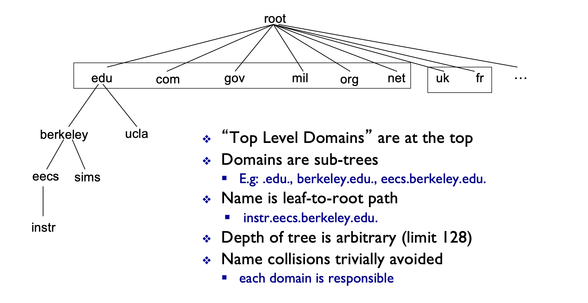

### Server Hierachy
- ICANN (Internet Corporation for Assigned Names and Numbers) manages root DNS domain
  
Top of hierarchy: Root servers
- Location hardwired into other servers
  
Next Level: Top-level domain (TLD) servers
- .com, .edu, etc. (several new TLDs introduced recently)
- Managed professionally

Bottom Level: Authoritative DNS servers
- Store the name-to-address mapping
- Maintained by the corresponding administrative authority

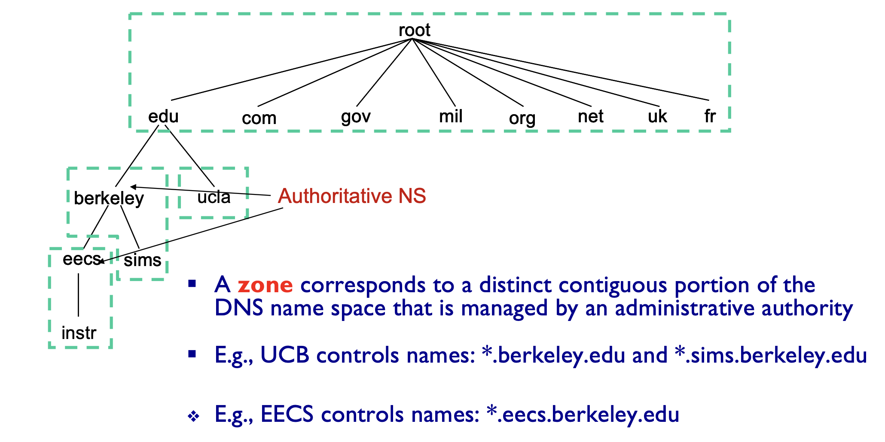

## Local DNS name servers
- Does not strictly belong to hierarchy
- Hosts learn about the local DNS server via a host configuration
protocol 
  - DHCP
- When host makes DNS query, query is sent to its local DNS server
  - local cache of recent name-to-address translation pairs 
  - acts as proxy, forwards query into hierarchy

## Iterated Query
- Implemented by Global DNS servers (the ones in hierachy)
  
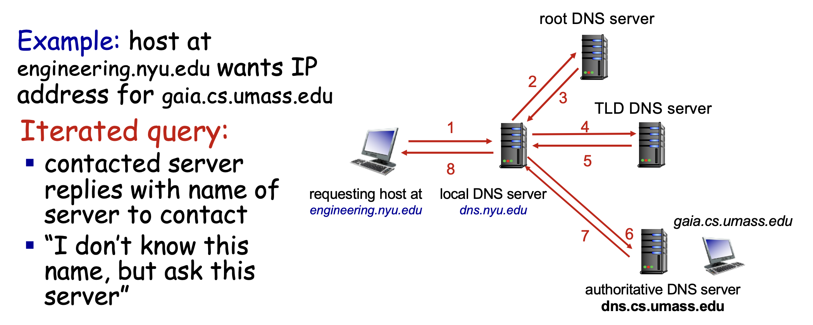

## Recursive Query
- Implemented by Local DNS server
  
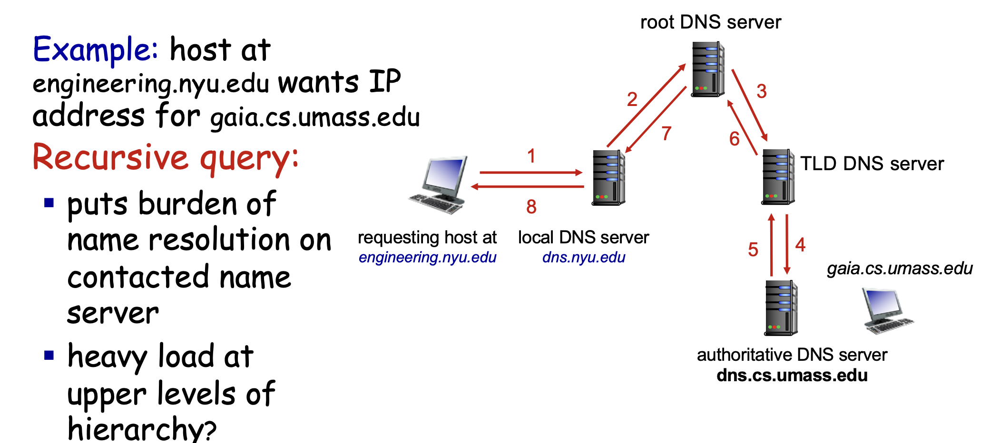

### Caching, Updating DNS Records
Once (any) name server learns mapping, it **caches mapping**
- cache entries timeout (disappear) after some time (TTL)
- cached entries may be out -of -date
- TLD servers typically cached in local name servers (root typically not visited)

## DNS Records
Distributed database storing **resource records (RR)**
- **RR** format: (name, value, type, ttl)
  
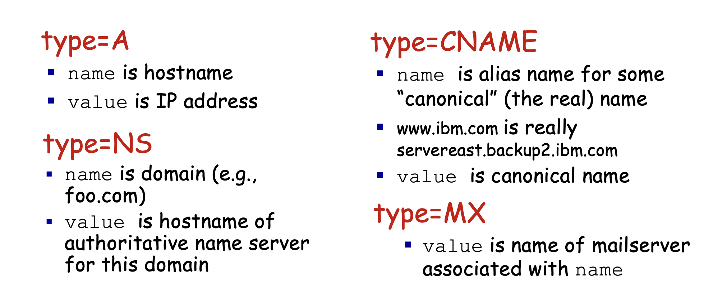

### Example: Inserting into DNS
Register name **networkuptopia.com** at DNS registrar 
- provide names, IP addresses of authoritative name server (primary and
secondary)
- registrar inserts NS, A RRs into .com TLD server:
  - (networkutopia.com, dns1.networkutopia.com, NS)
  - (dns1.networkutopia.com, 212.212.212.1, A)

### DNS protocol messages
DNS **query** and **reply** have the same format

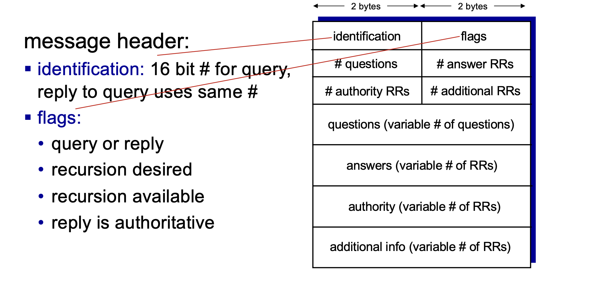
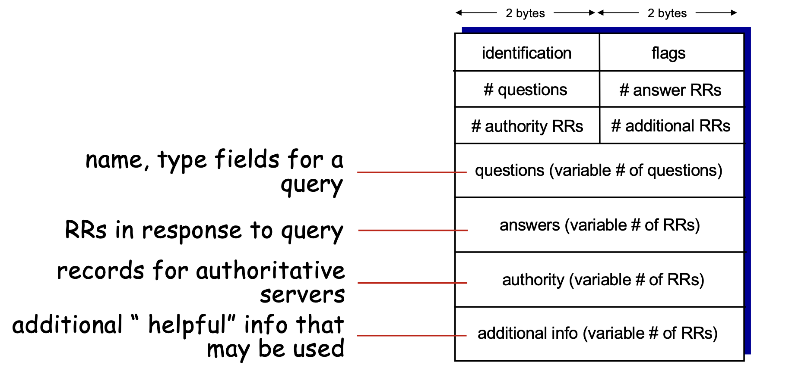

### DNS Reliability
- DNS servers are replicated (primary/secondary)
- DNS uses port 53

### DNS Security

**DDOS**
Bombard root servers with traffic

**Redirect attacks**
- Man in the middle: intercept DNS queries
- DNS poisoning: send bogus replies to DNS which caches

## Peer-peer architecture (P2P)
- no need for always-on server
- peers request service from other peers and provide servce in return to other peers
- intermittently connected and change IP address

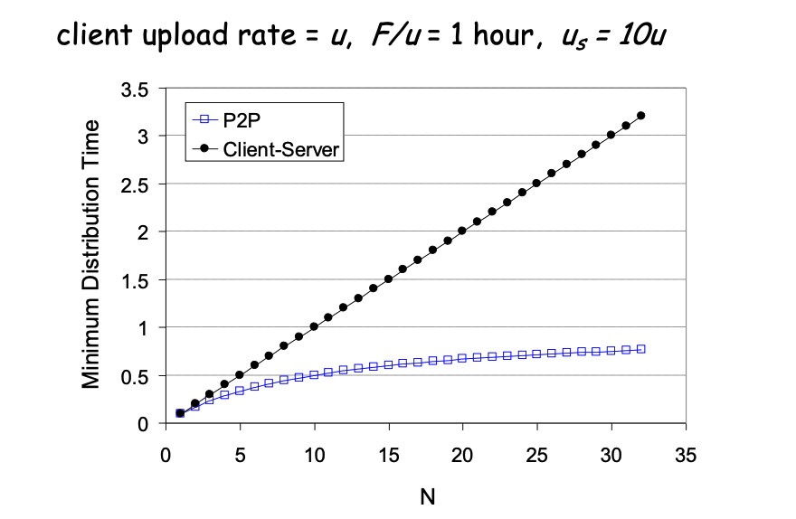

### Example: BitTorrent
- peers in torrent send/receive file chunks

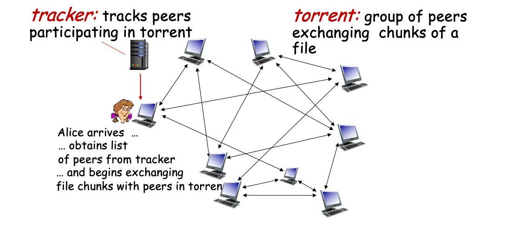

**Requesting chunks**

- At any given time, different peers have different subsets of file
- Peers ask fellow peers what chunks they have
- Peers request for missing chuncks **rarest** first

**Sending chunks (tit-for-tat)**
Peer sends chunks to those four peers currently sending chunks her chunks at highest rate
- re-evaluate top 4 every 10 secs
- every 30 secs: randomly select another peer, starts sending chunks
  - “optimistically unchoke” this peer
  - newly chosen peer may join top 4

## Video Streaming
**Videos**: sequence of image displayed at constant rate  
**Image**: array of pixels (each pixel is a bit)

Solution: use redudancy (repeated elements) within the between images to decrease number of bits used

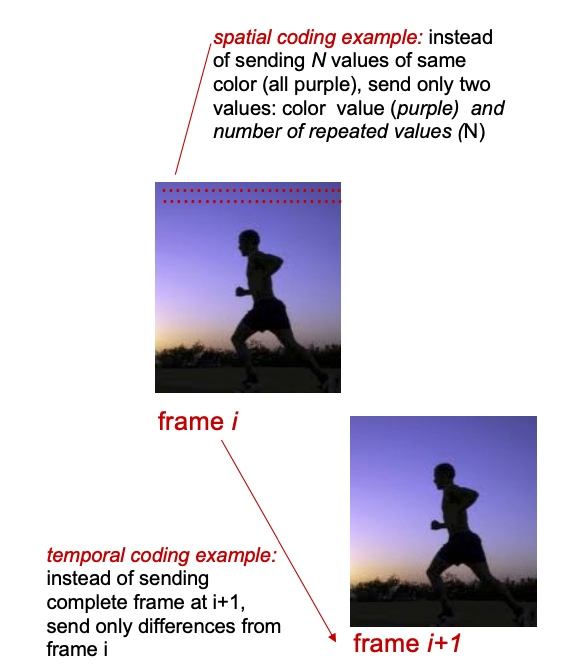

## DASH: Dynamic, Adaptive, Streaming over HTTP
**Server**

- divides video into multiple chunks
- each chunkc stored, encoded at different rates
- **manifest file**: URL for different chunks

**Client**

- periodically measures server-to-client bandwidth
- consulting manifest, requests one chunk at a time

**Streaming Video = encoding + DASH + playout buffering**

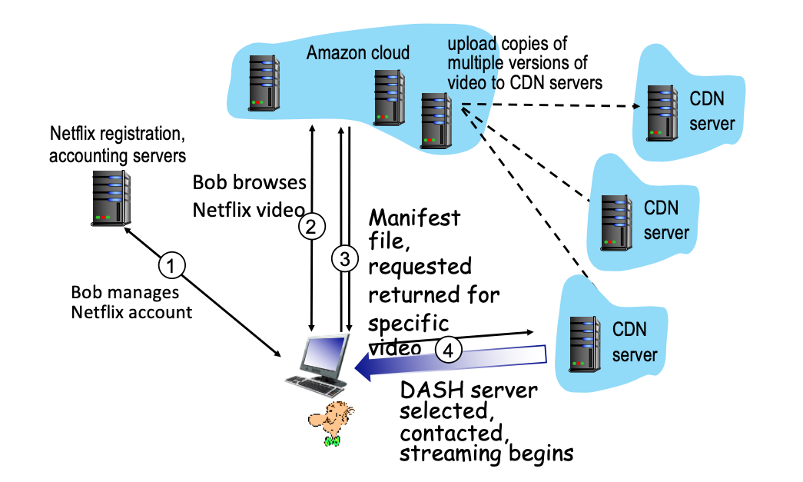

# Transport Layer
## Transport services and Protocols
- logical communication between application processes running on different hosts
- sender: breaks applications messages into segments 
- receiver: reassembles segments into messages
- Protocols available: TCP, UDP

## Highlevel: TCP and UDP
**TCP:** Transmission Control Protocol
- reliable, in-order delivery
- congestion control
- flow control
- connection setup

**UDP:** User Datagram Protocol
- unreliable, unordered delivery
- faster than TCP (used of VOIP)
- no delay or bandwidth guarantees

## Multiplexing and Demultiplexing
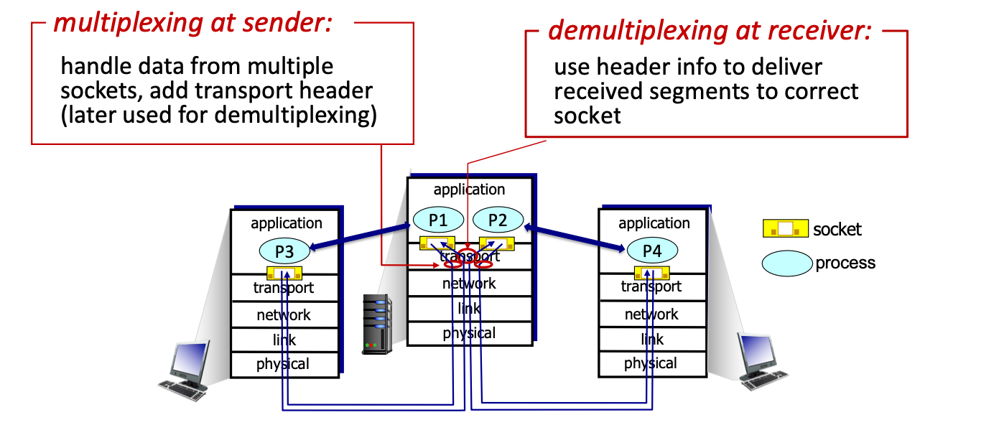

### UDP -  Connectionless demultiplexing
When host receives UDP segment:
- Checks **destination port number** in segment and directs UDP segment to **socket** with that port number.
- UDP datagrams with **same destination port** but different source IP will be directed to **same socket at host**.

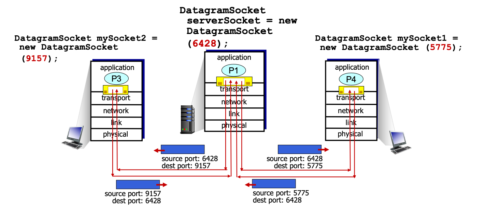

### TCP -  Connection demultiplexing
TCP socket identified by 4-tuple:
- source IP address
- source port number
- destination IP address
- destination port number

Demux: receiver uses all four values to direct segment to appropriate socket.

**X = 80** in image below

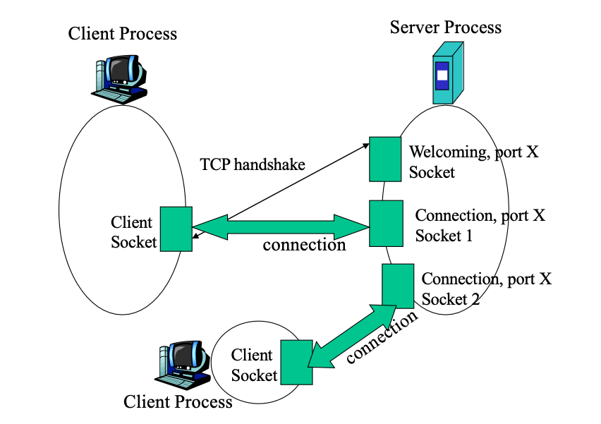
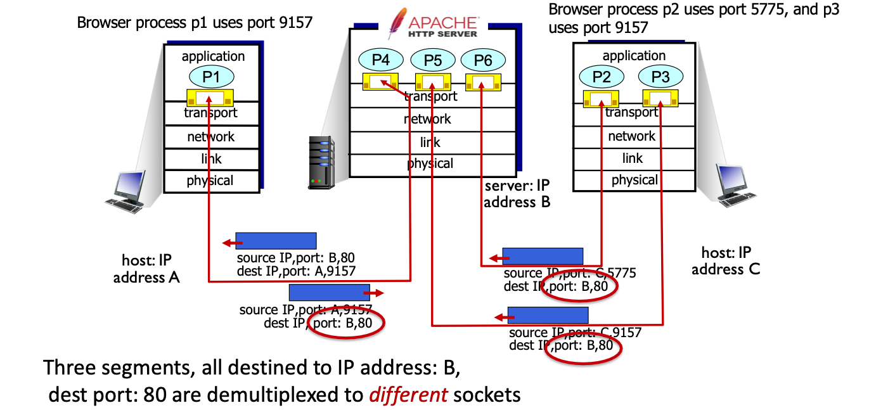

- UDP: demultiplexing using destination IP and port number
(only)
- TCP: demultiplexing using 4-tuple: source and destination IP
addresses, and port numbers

## UDP: User Datagram Protocol
Internet transport protocol with best-effort service so segments may be:
- lost
- delivered out-of-order to app

**Connectionless**
- **no handshaking** between sender and receiver (no RTT delay)
- no connection state at sender, receiver
- small header size
- no congestion control
  - UDP can still transport if network is congested
- each UDP segment handled indepdendently of others

**Applications that use UDP**
- DNS
- SNMP (network management)
- HTTP/3

If reliable transfer needed over UDP:
- add reliability **at application layer**
- add congestion control **at application layer**

### UDP: Transport Layer Actions
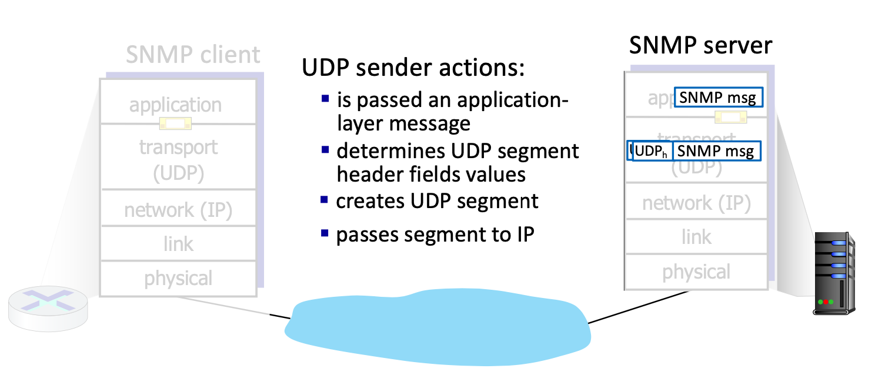
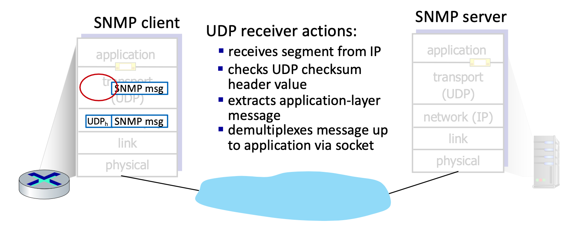

### UDP segment format
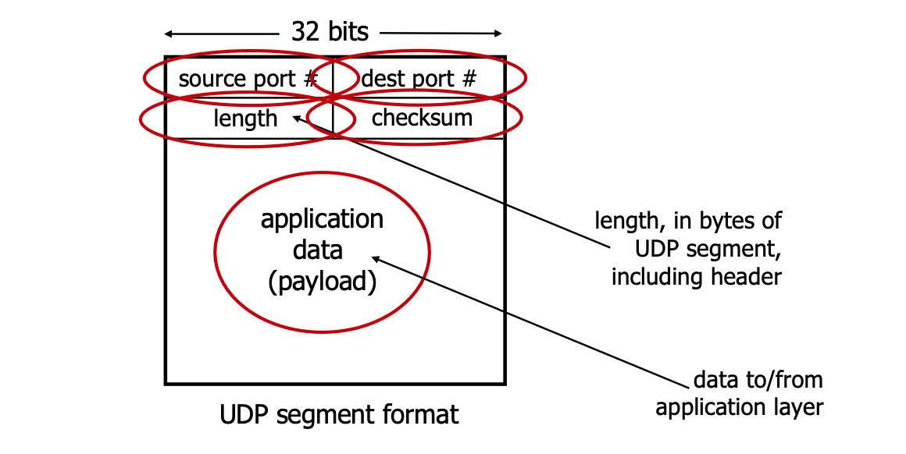

### UDP Checksum
Detect errors (flipped bits) in transmitted segment
- Treat content of UDP segment as sequence of 16-bit integers and check **sum of transmitted = sum of received**

Transmitted: 5 + 6 = 11  
Received: 4 + 6 = 10  
11 $\neq$ 10, so there was a error. 

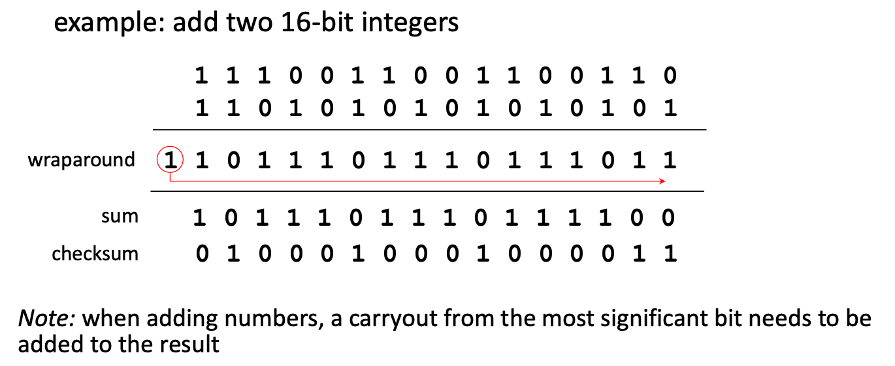

### Checksum Example
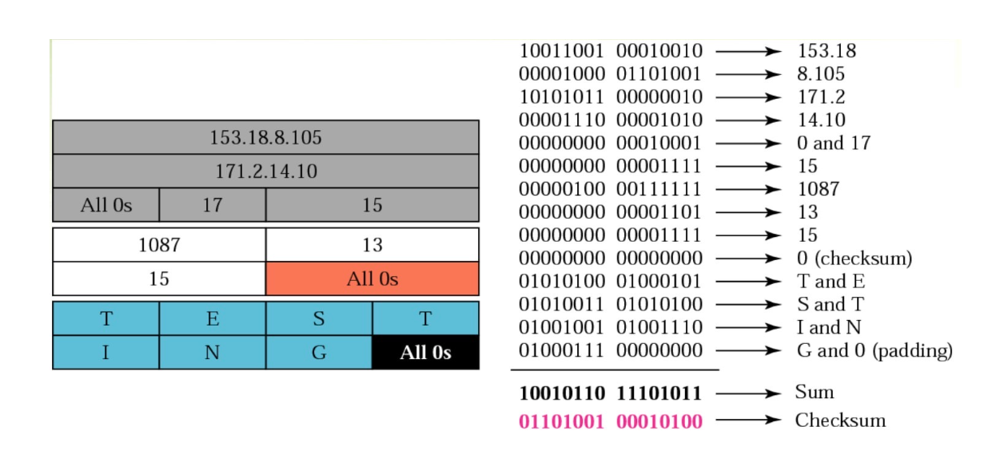

At the receiver, when adding all the values together the result should be a 16-bit sequence of **All 1s** (result of using 1's complement, adding the last two line in the image above). The receiver uses an `AND` gate so result is 1, otherwise there was an error (bit flip).

## Reliable data transfer
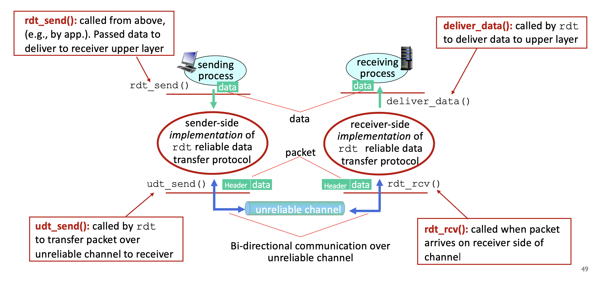

## rdt 1.0 reliable transfer over a reliable channel
underlying channel perfectly reliable
- no bit errors
- no loss of packets
- no out of order delivery
  
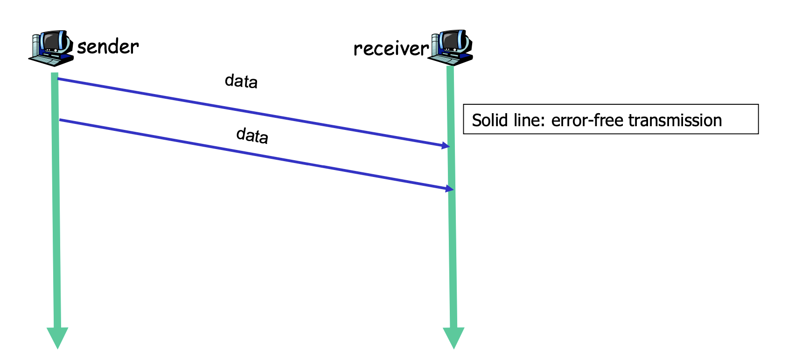

## rdt2.0: channel with bit errors
underlying channel may flip bits in packet
- **checksum** used to detect bit errors at receiver.

**How do we recover from detected errors?**
- **acknowledgements (ACK)**: receiver explicitly tells sender that packet received OK.
- **negative acknowledgements (NACK)**: receiver explicitly tells sender that packet had errors.
- sender retransmits packet on receipt of NAK

**STOP AND WAIT**: sender sends one packet, then waits for receiver response.

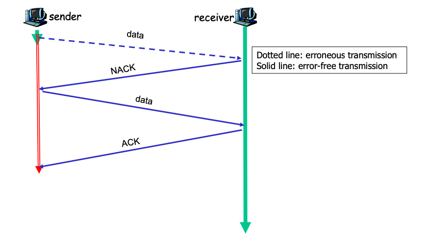


### Flaw with rdt2.0
Both ACK/NAK can be corrupted. Sender retransmisted current packet if ACK/NAK is corrupted.

## rdt2.1 

**Sender**:
- Sequence number #added to each packet.
- Two sequence numbers: #0 or #1.
- must check if receiverd ACK/NACK is corrupted.

**Receiver**:
- Must check if received packet is duplicated.
- Receiver does not know if its last ACK/NAK received OK at sender.

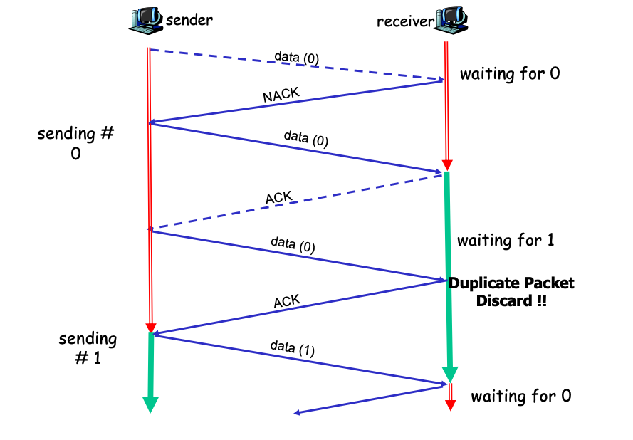

## rdt2.2: a NACK-free protocol
same functionality as rdt2.1, using **ACKs only**
- instead of NAK, receiver sends ACK for last packet received OK
  - receiver must explicitly include seq# of packet being ACKed
- duplicate ACK at sender results in a retransmit current packet.
  
As we will see, TCP uses this approach to be NAK-free.

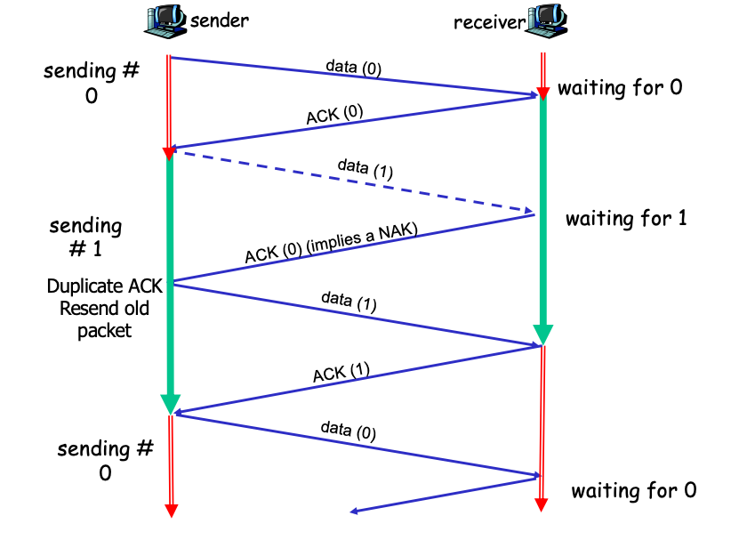

## rdt3.0: channels with errors **and loss**
underlying channel can also lose packets (data, ACKs), not just bit flip errors.

**Solution**: 
Sender waits **“reasonable” amount of time** for ACK
- Automatic retransmit if no ACK received in this time.
- Ff pkt (or ACK) just delayed (not lost):
  - retransmission will be duplicate, seq#s handles this.

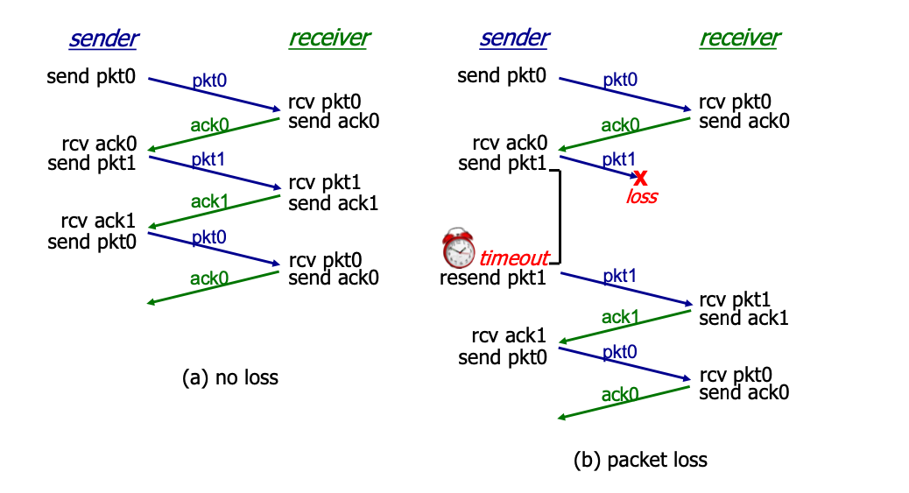
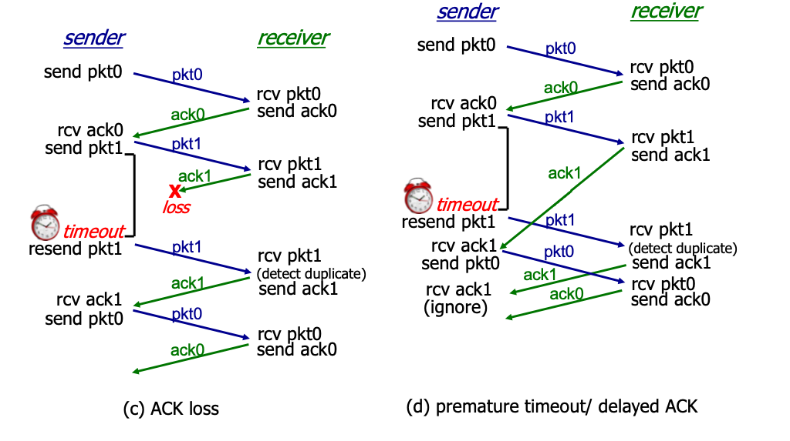

### Performance of rdt3.0
$U_{sender}$: utilisation – fraction of time sender busy sending

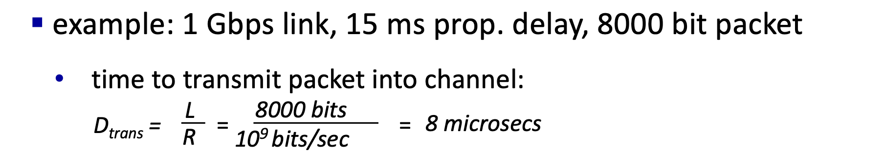
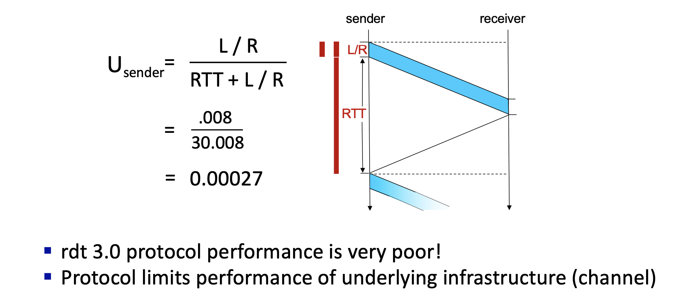

## Channel utilisation formula
$U_{sender} = x * \frac{\frac{L}{R}}{RTT + \frac{L}{R}}$  

$x$ = windows size  
$L$ = length of packet (bits)  
$R$ = bandwidth (bits/sec)  
$RTT$ = round trip time (sec)

## rdt3.0: pipelined protocols operation
**pipelining**: sender allows multiple, “in-flight”, yet-to-be-acknowledged
packets
- range of sequence numbers must be increased
- buffering at sender and/or receiver

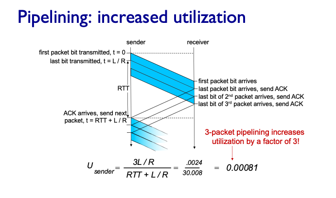

## Go-Back-N: sender
- Sender: window of up to N, consecutive transmitted but **unACKed** packets 
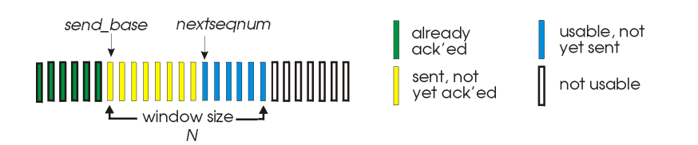

- cumulative ACK: ACK(n): ACKs all packets up to, including seq # n
  - on receiving ACK(n): move window forward to begin at n+1
- timer for oldest in-flight packet
- timeout(n): retransmit packet n and all higher seq # packets in window

## Go-Back-N: receiver
- Receiver: window size of 1. 
- Always send ACK for correctly-received packet so far, with highest **in-order** seq#.
  - only need to remember `rcv_base`

- on receipt of out-of-order packet:
  - can discard (no buffer) or buffer: an implementation decision
  - re-ACK packet with highest **in-order** seq#

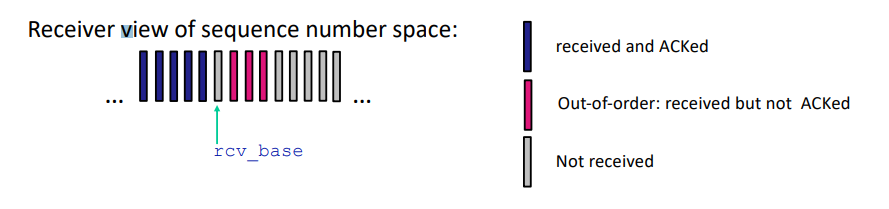
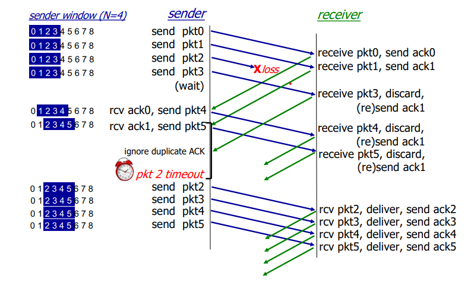

## Selective repeat
- Receiver individually acknowledges all correctly received packets
  - buffers packets, as needed
- sender times-out/retransmits individually for unACKed packets
  - sender maintains timer for each unACKed packets
- sender window
  - N consecutive seq #s
  - limits seq #s of sent, unACKed packets
  
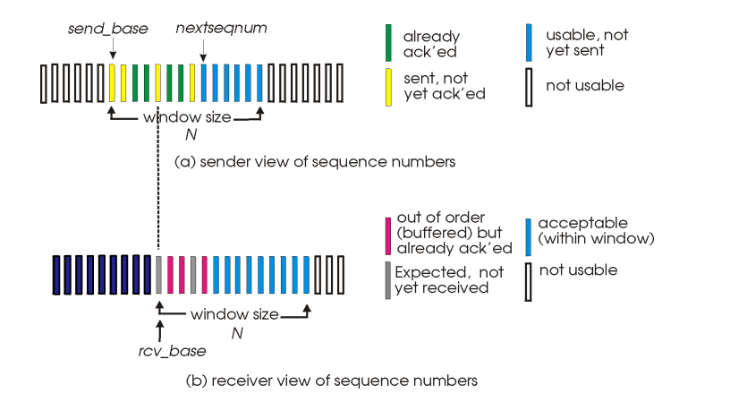
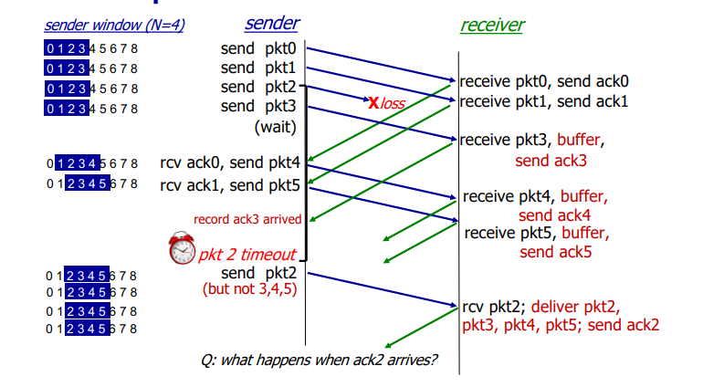

## Selective repeat problem
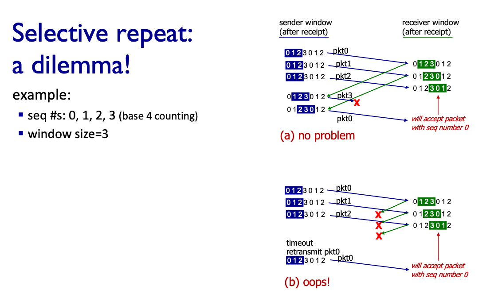

a) No issues since receiver recognises **pk3 is lost** and new pk0 is buffered (since it is in the receivers current window) until **pk3** is retransmitted and received.

b) Issue because the receiver window is already contains **new pk0**, however the **old pk0** is retransmitted since it there was no **ack1 was lost**.

### Solution to selective repeat problem
Sender window size $\leq \frac{1}{2}$ sequence number space 

- The sequence number space is 4 (0, 1, 2, 3). So window size $\leq$ 2

## Connection-oriented transport: TCP

## TCP Header
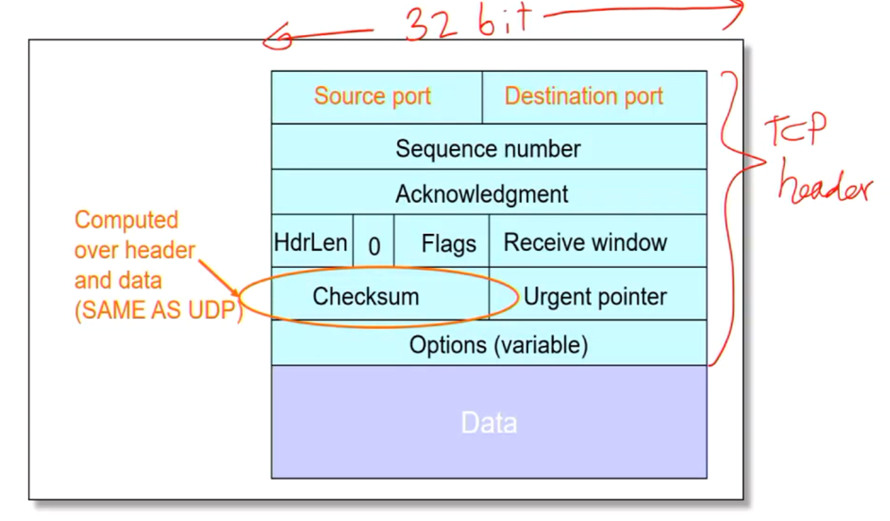

- Sequence number can be up to 32 bits, which represents up to $2^{32}$ numbers $\approx$ 4 billion 
- **HdrLen = Header Length** (required since header length not fixed, but rarely used)
  - Min length = 20 bytes (most common), Max length = 60 bytes
- **Checksum**: computer over header and data

## TCP Sequence number are byte offsets

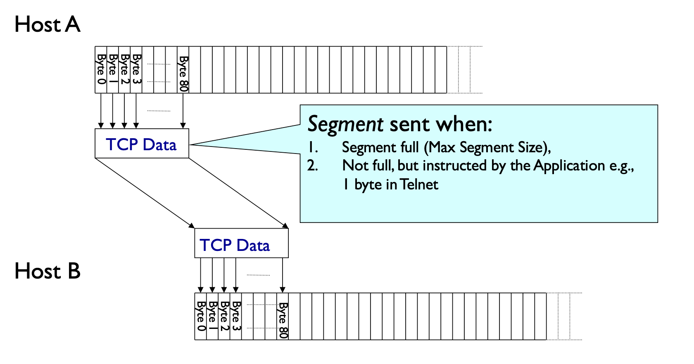

### TCP Maximum Segment size
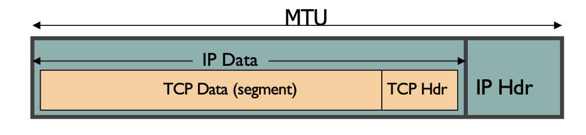

- IP Packet
  - **IP Packet = IP header + IP segment/payload (TCP Packet)**
  - No bigger than Maximum Transmission Unit (**MTU**) of link layer
  - Example: 1500 bytes for Ethernet
- TCP packet
  - **TCP Packet = TCP Header + TCP segment/payload (Application layer data)**
  - TCP header $\geq$ 20 bytes
- TCP segment/payload
  - No more than maximum segment size (**MSS**) bytes
  - Up to 1460 consecutive bytes from the stream
  - **MSS = MTU - 20 (IP header) - 20 (TCP header)**

### TCP Sequence Numbers
**ISN = Initial sequence number** (not 0)

- Sequence number = ISN + k bytes
- ACK sequence number (next expected byte) = Sequence number + length(data)
  
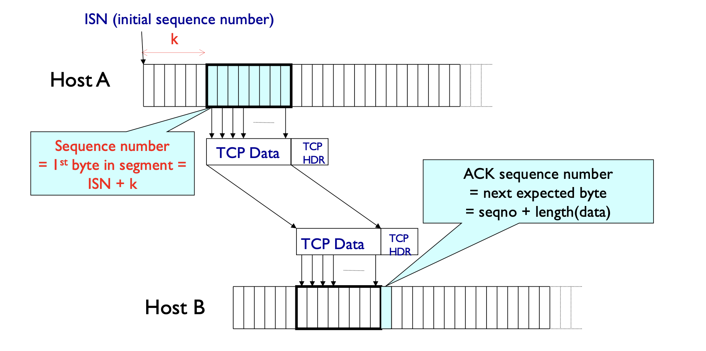

### Why chose random ISN
-  Avoids ambiguity with back-to-back connections between same end-points.
-  Potential security issue if the ISN is known.

## Cumulative Sequence Acknowledgements
ACKS are up to last highest in-order byte received

**Scenario 1**

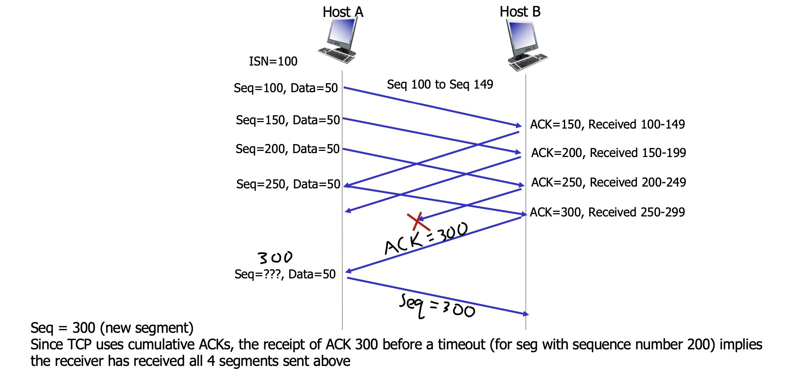

**Scenario 2**

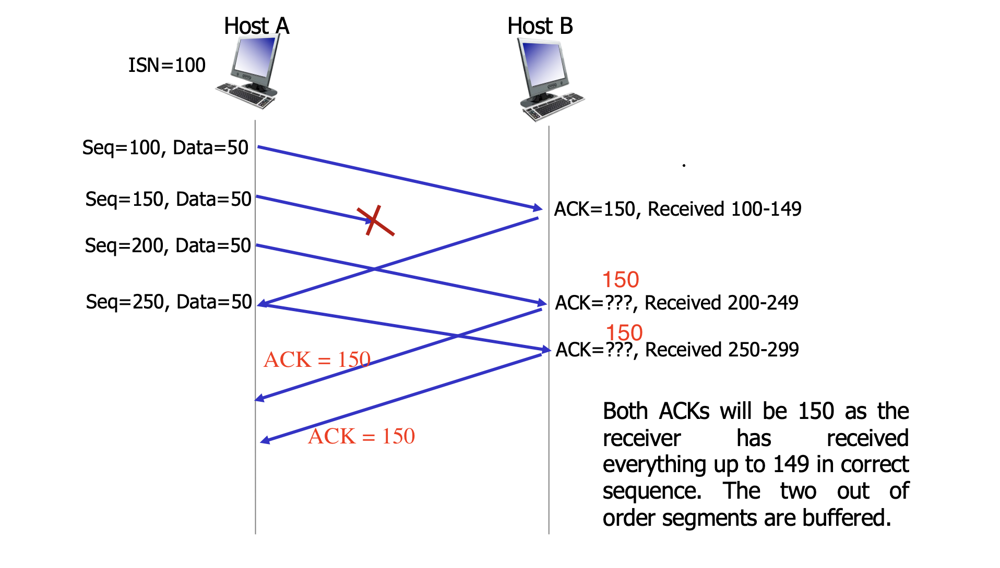

200 - 249 and 250 - 299 are buffered until 150 - 199 is received.

## Piggybacking (both sides send and transmit)
Both client and server send and receive data 
- 1 KBytes = 1024 bytes
- 1 kbps (kilo bit per second) = 1000 bps (bits per second)


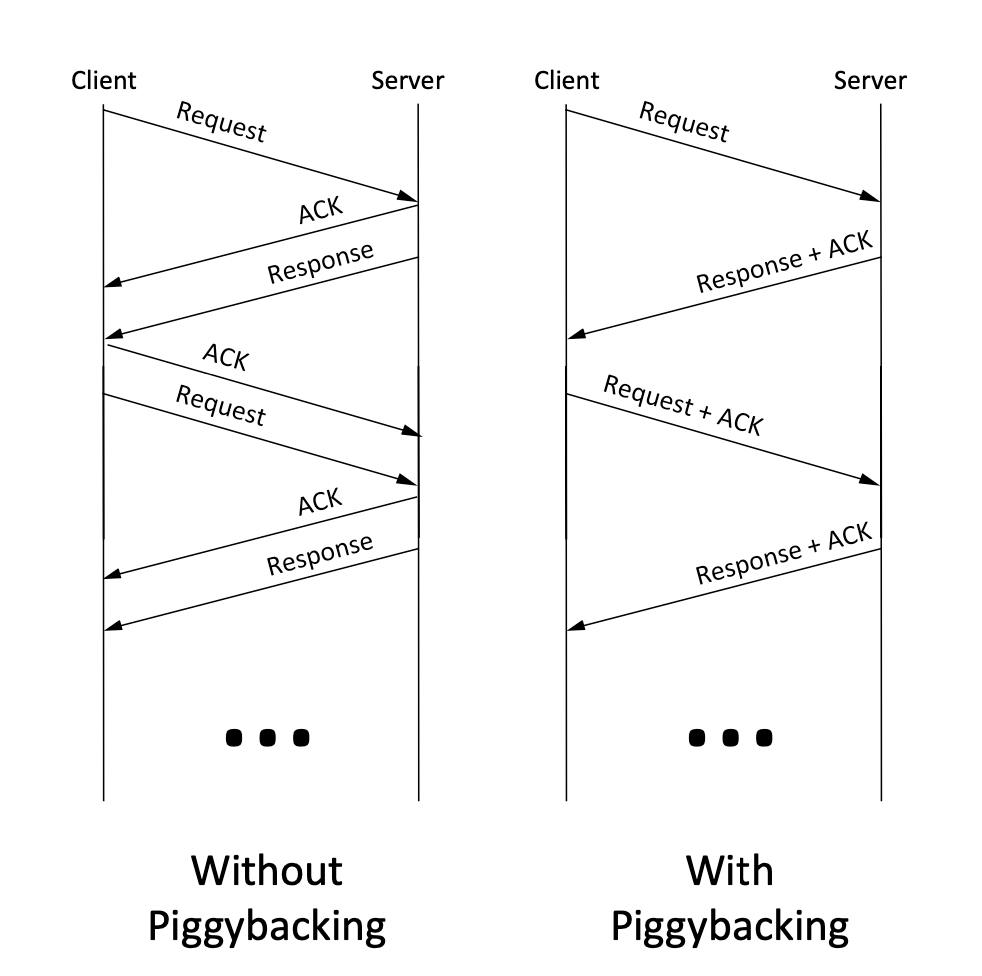
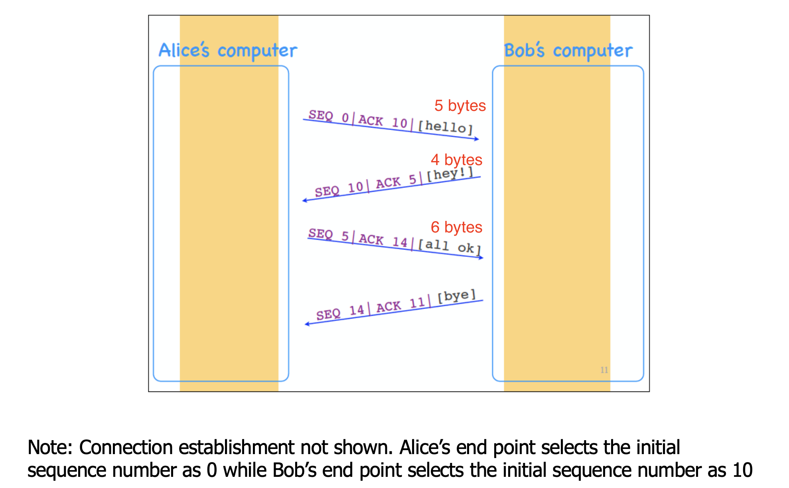
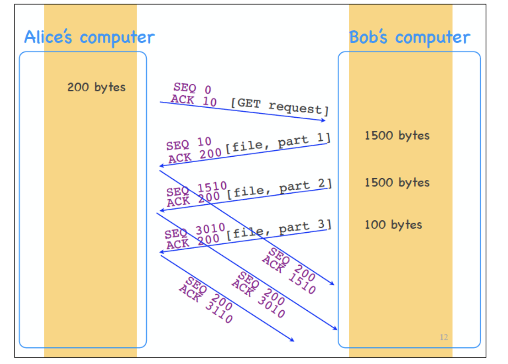

## TCP round trip time, timeout
**SampleRTT** = measured time from segment transmission until ACK
- this will vary, so instead we want an estimated RTT 

**EstimatedRTT = (1 - $\alpha$) * EstimatedRTT + $\alpha$ * SampleRTT**

- exponential weighted moving average (EWMA)
- influcent of past sample decreases exponentially faster
- typical value $\alpha$ = 0.125

**DevRTT = (1 - $\beta$) * DevRTT + $\beta$ * |SampleRTT - EstimatedRTT|**
- EWMA of SampleRTT deviation from EstimatedRTT
- typically, $\beta$ = 0.25 

**TimeoutInterval = EstimatedRTT + 4 * DevRTT**

### Exclude retransmissions in RTT computation
- Sender cannot differentiate between original ACK and retransmission ACK
- **RTT = Final ACK - Original transmission**

## TCP Fast retransmit
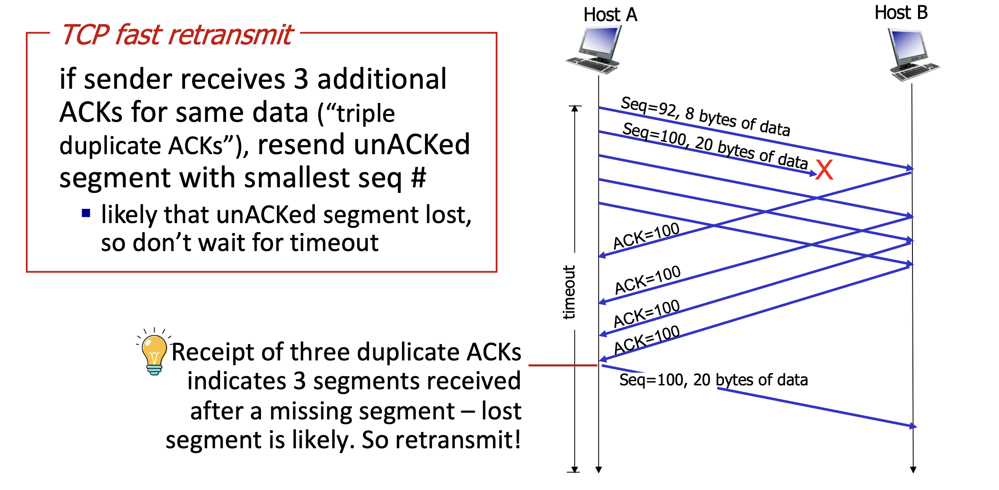
 
Note: 3 additionaly so 4th ACK.

## Flow Control
In TCP, window size is NOT fixed, it is **adaptive**, it controls the number of packets that can be sent out without waiting for an ACK. Adjusting the window size helps with flow control.