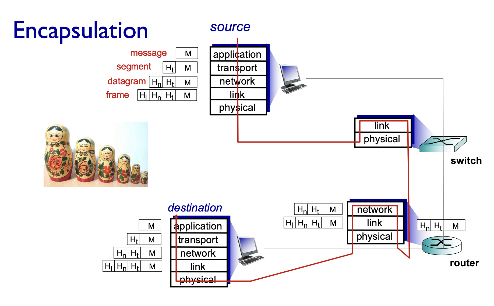

# 3331 Notes

### General Info

Lecturer: Wen Hu   
Course email: cs3331@cse.unsw.edu.au

- Labs: 20%
- Assignment: 20%
- Mid Term: 20% (Open-Book online at home)
- Final: 40% (Closed-Book online at uni)

## Protocol
Protocols define the **format**, **order** of **messages sent and received** among network entities, and **actions taken** on messages transmission, receipt.

## Internet strucutre

**Network edge**
- hosts: clients and servers
- servers often in data centers


**Access networks, physical media**
- wired, wireless communication links
 


**Network core**
- interconnected routers
- network of networks
  


## Network Edge

### Digital subscriber line (DSL) (old)

- use existing telephone line to central office DSLAM 
  - data over DSL phone line goes to Internet
  - voice over DSL phone line goes to telephone net


### Cable-based access

**Hybrid fiber coax (HFC):** up to 40-1200 Mbps downstream transmission rate, 30-100 Mbps upstream transmission rate

- network of cable, fiber attaches homes to ISP router 
  - homes share access network to cable headend


-  Fully optical fiber path all the way to the home (or premise or curb)


### Home networks


### LAN and WAN
**LAN (Local area network)**
- typically within or around building (~100 ft)
- 802.11b/g/n (WiFi): 11, 54, 450 Mbps transmission rate

**WAN (Wide area network)**
- provided by mobile, cellular network operator (10’s km)
- 10’sMbps
-  4G cellular networks (5G coming)

### Enterprise networks
- mix of wired, wireless link technologies, connecting a mix of switches and routers 

## Network Core
### Circuit Switching
End-end resources allocated to, reserved for “call” between source and destination


### Packet Switching
Hosts break application-layer messages into **packets**

- Data is sent as chunks of formatted bits (**Packets**) 
- Packets consist of a **“header”** and **“payload”**
  - payload is the data being carried
  - header holds instructions to the network for how to handle packet
- Switches “**forward**” packets based on their headers


- store and forward packet switching


## Packet Overloading


## Packet delay
Four sources of packet delay:
- propogation delay
- queueing delay
- transmission delay
- nodal processing

$L$ = packet length (bits)  
$R$ = link bandwidth (bits/sec)  
$a$ = packet arrival rate (packets/sec)


## Packet loss
- queue (aka buffer) preceding link in buffer has finite capacity
- packet arriving to full queue dropped (aka lost)
- lost packet may be retransmitted by previous node,
source end system, or not at all


## Throughput
- **Throughput**: rate (bits/time unit) at which bits are being sent from sender to receiver
- instantaneous: rate at given point in time 
- average: rate over longer period of time


When $R_s < R_c$, average end-end throughput is $R_s$, since it is the bottleneck

## Internet protocal stack
- **Application**: supporting network applications 
  - FTP, MSTP, HTTP, email, WWW, Phone
- **Transport**: process-process data transfer
  - TCP, UDP
- **Network**: routing of datagrams from source to destination
  - IP, routing protocols
- **Link**: data transfrer between neighbouring network elements
  - Ethernet, 802.11 (WiFi), PPP
- **Physical**: bits on the wire
  - copper, fibre, radio


Each layer depends on layer below and supports layer above (indepdendent of others)

## Internet Layered Architecture



# Application Layer (Principles, Web, Email)

## Client-server paradigm
**Server**:
- always-on host
- permanent IP address
- often in data centers
  
**Clients**:
- contact, communicate with server
- may be intermittently connected
- may have dynamic IP addresses
- do not communicate directly with each other
- examples: HTTP, IMAP, FTP

## Peer-peer architecture (P2P)
- no need for always-on server
- peers request service from other peers and provide servce in return to other peers
- intermittently connected and change IP address

## Processes communicating
**Process:** program running within a host  
**Client process:** process that initiates communication  
**Server process:** process that waits to be contacted
- applications wtih P2P have client and server process

## Sockets
- A **socket** is one endpoint (IP and port) of a two-way communication link between programs on a network.
  


- To receive messages, processes must have an **identifier**
- Host devices has a **unique 32-bit IP address** and a **port number** associated to process
  - HTTP server: port 80
  - mail server: port 25
- **Identifier** includes **both** the IP address and port number
- To send HTTP message to http://gaia.cs.umass.edu/ web server:
  - IP address: 128.119.245.12
  - Port number: 80

## Application-layer protocol defines


### What transport service does an app need?
- **data integrity** - some apps require 100% file transfer
- **timing** - some apps require low delay (internet telephony, games)
- **throughput** - some apps require min throughput 
- **sercurity** - encryption, data integrity

## Uniform resource locator (URL)
`protocol://host-name[:port]/directory-path/resource`

- **protocol**: http, tfp, https, smtp
- **hostname**: DNS name, IP address
- **port**: defaults to protocol standard(http: 80, https: 443)
- **directory path**: file system
- **resource**: identifies resource

Example: `www.someschool.edu/someDept/pic.gif`

## HTTP overview
**HTTP: hypertext transfer protocol** 
- **client**: browser that requests,receives, (using HTTP protocol) and “displays” Web objects
- **server**: Web server sends (using HTTP protocol) objects in response to requests


- Uses TCP
  - client initiates connection, server accepts, HTTP message exchanged
- HTTP is stateless
  - server maintains no info about previous requests
- type types of HTTP messgaes: **request, response**

### Types of HTTP requests


### HTTP response status codes
**200** OK
- request succeeded, requested object later in this message
  
**301 Moved Permanently**
- requested object moved

**400 Bad Request**
- request msg not understood by server

**404 Not Found**
- requested document not found on this server

### HTTP is all text
- makes protocol simple
- not the most efficient
  - "12345678" - 8 bytes
  - 12345678 - 4 bytes

## Maintaining user/server state: cookies
Web sites and client browser use **cookies** to maintain some state between transactions


- authorisation
- shopping carts
- recommendations

**Cookies and Privacy**
- cookies permit sites to learn a lot about you on their site
- third party persistent cookies allow common identity to be tracket across multiple web sites

## Page Load Time (PLT)
Page Load Time (PLT) is an important metric
- from click (or typing url) until user sees page
- key measurement of web performance

Depends on many factors such as
- page content/structure,
- protocols involved and
- Network bandwidth and RTT

## Non-persistent HTTP (HTTP/1.0)
**Non-Persistent**: **One TCP connection** to fetch **one web resource** (connection then closed)
- downloading multiple objects requires multiple connections


**RTT** (Round trip time): time for a small packet to travel from client to server and back

- one RTT to initiate TCP connection
- one RTT for HTTP request and first few bytes to return
- file transmission time


### Non-persistent HTTP response time formula

1 Object Time = 2RTT + file transmission time  

N Objects Time = N(2RTT + file transmission time)

### Concurrent Request and Responses (Possible solution to slow PLT)
- Use multiple connections in parallel
- Does not necessarily maintain order of responses

**Downsides**
- Too much overhead (so many different connections to server at once)

## Persistent HTTP (HTTP/1.1)
- server leaves TCP connection open after sending response
- subsequent HTTP messages between same client/server are sent over the same TCP connection

**Persistent without pipelineing**
- client issues new request only when previous response has been received
- one RTT for each referenced object

**Persistent pipelineing**
- introduced in HTTP/1.1
- client sends requests as soon as it encounters a referenced object
- as little as one RTT for all the referenced objects


<br>

**Better image to display persistent with pipelining**


- line 1 - base index file
- lines 2, 3, 4 - objects on page

### Downsides of HTTTP1.1
- server responds in **FCFS**(first-come-first-served scheduling) to `GET` requests
- small object may have to wait for transmission behind large object resulting in HOL(head of line) blocking


## HTTP/2: mitigating HOL blocking
- transmission order of requested objects based on client-specified
object priority (not always FCFS)
- divide objects into frames, schedule frames to mitigate HOL blocking


## Web caches: proxy server
Goal: satify client request without involging origin server

- user configures browser to point to a Web cache
- browser sends all HTTP requests to cache

```
if object in cache:
  cache returns cached object to client
else:
  cache requests object origin, then caches object then return
```


## Example: how caching improves speeds
**LAN utilisation**: data rate / LAN speed  
**Access link utilisation**: data rate / access link rate


- cache hit rate: chance that the HTTP request is already stored in the local web cache

## Conditional `GET`: cache at client browser
- no object transmission delay
- lower link utilisation 

**cache**: specify date of cached copy in `HTTP` request  
**If-modified-since: < date >**

**server**: response contains no object  
If cached copy is up-to-date:  
**HTTP/1.0 304 Not Modified**

## Replication: improving HTTP 
Replicate popular Web site across many machines
- Spreads load on servers
- Places content closer to clients
- Helps when content isn’t cacheable

## CDN (Content Delivery Network): improving HTTP 
- Caching and replication as a service
- Large-scale distributed storage infrastructure

- Combination of (pull) caching and (push) replication
  - Pull: Direct result of clients’ requests
  - Push: Expectation of high access rate

## Electronic Mail
User Agent
- composing, editing, reading mail messages
- outgoing, incoming messages stored on server
- e.g., Outlook, iPhone mail client

mail servers:
- mailbox contains incoming messages for user
- message queue of outgoing (to be sent) mail messages
- **SMTP** protocol between mail servers to send email messages
  - client: sending mail server
  - “server”: receiving mail server

**Format**


### Mail example:


### Mail access protocol
- **SMTP**: delivery/storage of e-mail messages to receiver’s server
- mail access protocol: retrieval from server
  - IMAP: Internet Mail Access Protocol: IMAP provides retrieval, deletion, folders of stored messages on server
- HTTP: provides web-based interface on top of STMP (to send), IMAP to retrieve e-mail messages
  - gmail, Hotmail, Yahoo! Mail, etc. 

