# 3331 Notes

### General Info

Lecturer: Wen Hu   
Course email: cs3331@cse.unsw.edu.au

- Labs: 20%
- Assignment: 20%
- Mid Term: 20% (Open-Book online at home)
- Final: 40% (Closed-Book online at uni)

## Protocol
Protocols define the **format**, **order** of **messages sent and received** among network entities, and **actions taken** on messages transmission, receipt.

## Internet strucutre

**Network edge**
- hosts: clients and servers
- servers often in data centers


**Access networks, physical media**
- wired, wireless communication links
 
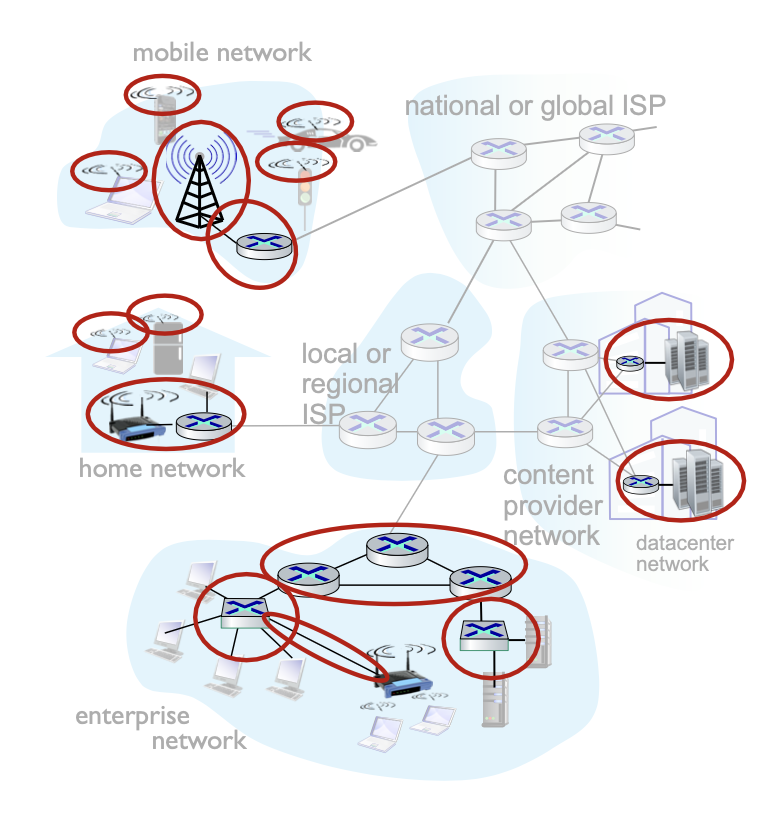

**Network core**
- interconnected routers
- network of networks
  


## Network Edge

### Digital subscriber line (DSL) (old)

- use existing telephone line to central office DSLAM 
  - data over DSL phone line goes to Internet
  - voice over DSL phone line goes to telephone net


### Cable-based access

**Hybrid fiber coax (HFC):** up to 40-1200 Mbps downstream transmission rate, 30-100 Mbps upstream transmission rate

- network of cable, fiber attaches homes to ISP router 
  - homes share access network to cable headend

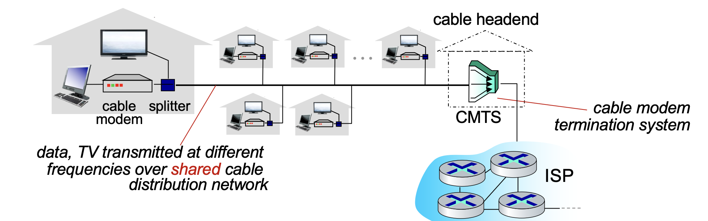

-  Fully optical fiber path all the way to the home (or premise or curb)

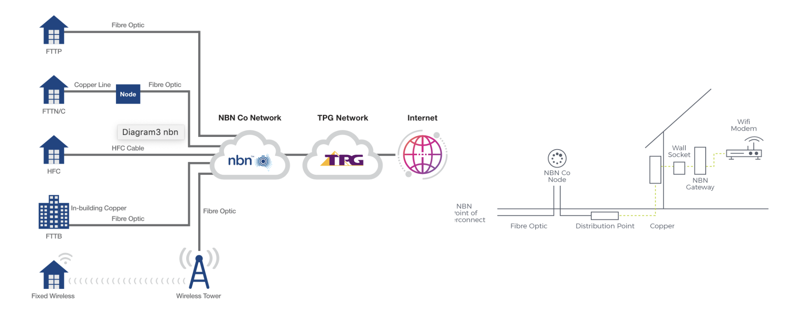

### Home networks


### LAN and WAN
**LAN (Local area network)**
- typically within or around building (~100 ft)
- 802.11b/g/n (WiFi): 11, 54, 450 Mbps transmission rate

**WAN (Wide area network)**
- provided by mobile, cellular network operator (10’s km)
- 10’sMbps
-  4G cellular networks (5G coming)

### Enterprise networks
- mix of wired, wireless link technologies, connecting a mix of switches and routers 

## Network Core
### Circuit Switching
End-end resources allocated to, reserved for “call” between source and destination


### Packet Switching
Hosts break application-layer messages into **packets**

- Data is sent as chunks of formatted bits (**Packets**) 
- Packets consist of a **“header”** and **“payload”**
  - payload is the data being carried
  - header holds instructions to the network for how to handle packet
- Switches “**forward**” packets based on their headers


- store and forward packet switching


## Timing Diagrams
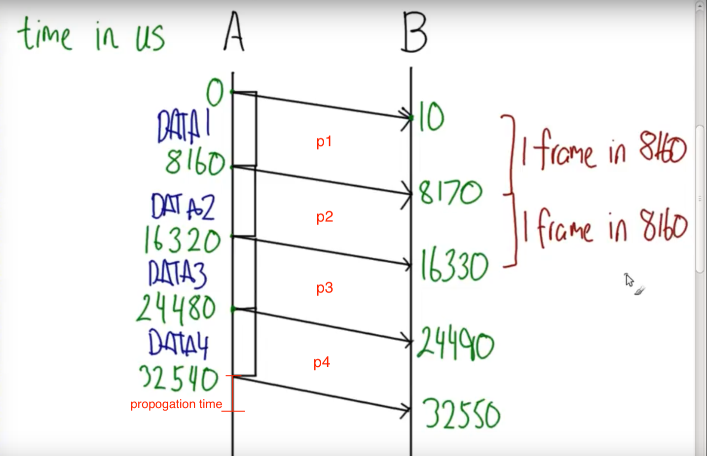

- propogation time is 10s for each bit in the packet, however the propagation time overlaps with the transmission time of the next packet, so you only need to consider propogation time **once** for all 4 packets at the very end (32540 - 32550).
- transmission time for the entire packet is 0 - 8160 s

## Statistical multiplexing
Method of sharing communication channel among multiple users (senders) over a link. If one user does not use its share of the bandwidth, it is then free to be used by other users. Thus, senders **share the link bandwidth**, with no user having all of the link bandwidth allocated to it. 

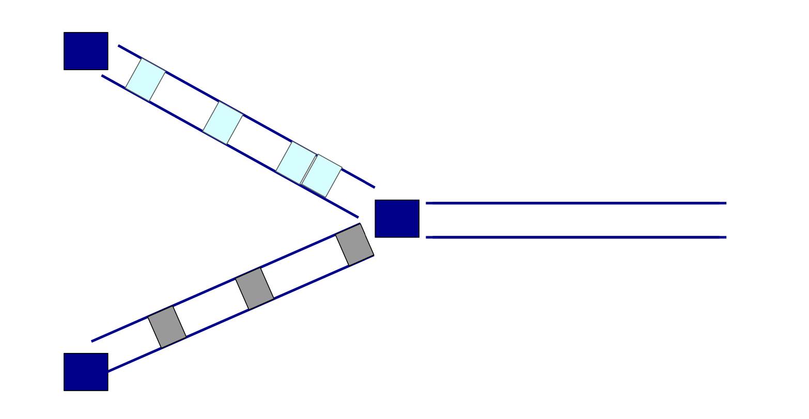
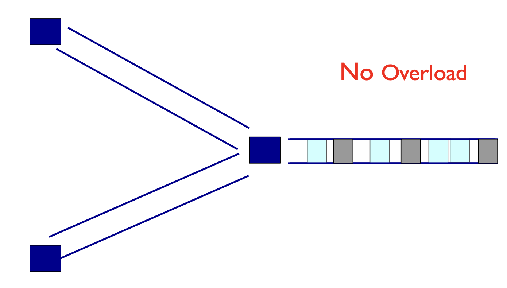


## Packet delay
Four sources of packet delay:
- propogation delay
- queueing delay
- transmission delay
- nodal processing

$L$ = packet length (bits)  
$R$ = link bandwidth (bits/sec)  
$a$ = packet arrival rate (packets/sec)


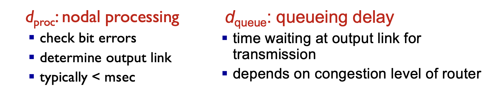
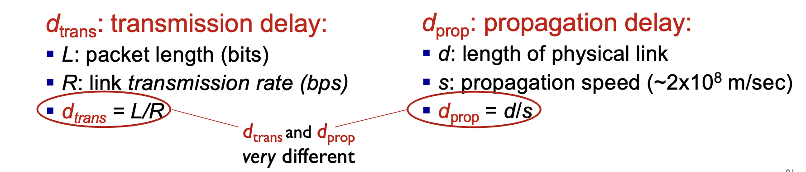

## Delay Formulas (single packet)
$d_{processing}$ = given

$d_{queue}$ = given

$d_{transmission} = \frac{L}{R}$

$d_{propogation} = \frac{d}{s}$

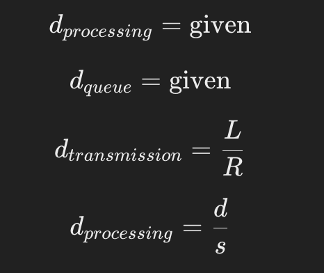

$L$ = packet length (bits)  
$R$ = link bandwidth (bits/sec)  
$a$ = packet arrival rate (packets/sec)  
$s$ = propogation speed (m/sec)

## Bandwidth Delay Product Formula
$BDP$ measures the amount of data that can be in transit in the network at any given time. I

$BDP= R \times RTT$

$BDP$ = Bandwidth Delay Product (bits/bytes)
$R$ = bandwidth (bits/sec or bytes/sec)
$RTT$ = round trip time (sec)

## Packet loss
- queue (aka buffer) preceding link in buffer has finite capacity
- packet arriving to full queue dropped (aka lost)
- lost packet may be retransmitted by previous node,
source end system, or not at all


## Throughput
- **Throughput**: rate (bits/time unit) at which bits are being sent from sender to receiver
- instantaneous: rate at given point in time 
- average: rate over longer period of time


When $R_s < R_c$, average end-end throughput is $R_s$, since it is the bottleneck

## Internet protocol stack (OSI model)
- **Application**: supporting network applications 
  - FTP, MSTP, HTTP, email, WWW, Phone
- **Transport**: process-process data transfer
  - TCP, UDP
- **Network**: routing of datagrams from source to destination
  - IP, routing protocols
- **Link**: data transfer between neighbouring network elements
  - Ethernet, 802.11 (WiFi), PPP
- **Physical**: bits on the wire
  - copper, fibre, radio


Each layer depends on layer below and supports layer above (indepdendent of others)

## Internet Layered Architecture
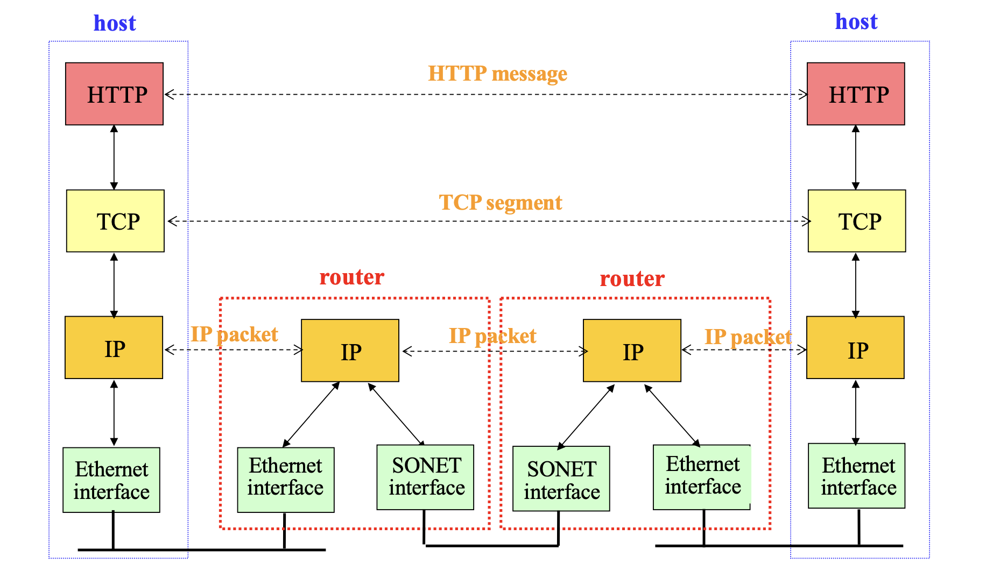


# Application Layer (Principles, Web, Email)

## Client-server paradigm
**Server**:
- always-on host
- permanent IP address
- often in data centers
  
**Clients**:
- contact, communicate with server
- may be intermittently connected
- may have dynamic IP addresses
- do not communicate directly with each other
- examples: HTTP, IMAP, FTP

## Processes communicating
**Process:** program running within a host  
**Client process:** process that initiates communication  
**Server process:** process that waits to be contacted
- applications wtih P2P have client and server process

## Sockets
- A **socket** is one endpoint (IP and port) of a two-way communication link between programs on a network.
  
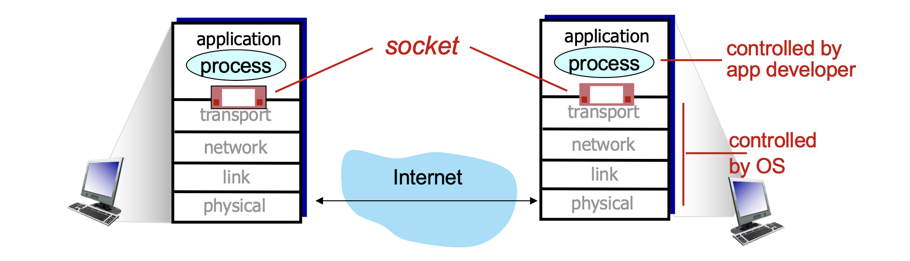

- To receive messages, processes must have an **identifier**
- Host devices has a **unique 32-bit IP address** and a **port number** associated to process
  - HTTP server: port 80
  - mail server: port 25
- **Identifier** includes **both** the IP address and port number
- To send HTTP message to http://gaia.cs.umass.edu/ web server:
  - IP address: 128.119.245.12
  - Port number: 80

## Application-layer protocol defines


### What transport service does an app need?
- **data integrity** - some apps require 100% file transfer
- **timing** - some apps require low delay (internet telephony, games)
- **throughput** - some apps require min throughput 
- **sercurity** - encryption, data integrity

## Uniform resource locator (URL)
`protocol://host-name[:port]/directory-path/resource`

- **protocol**: http, tfp, https, smtp
- **hostname**: DNS name, IP address
- **port**: defaults to protocol standard(http: 80, https: 443)
- **directory path**: file system
- **resource**: identifies resource

Example: `www.someschool.edu/someDept/pic.gif`

## HTTP overview
**HTTP: hypertext transfer protocol** 
- **client**: browser that requests,receives, (using HTTP protocol) and “displays” Web objects
- **server**: Web server sends (using HTTP protocol) objects in response to requests


- Uses TCP
  - client initiates connection, server accepts, HTTP message exchanged
- HTTP is stateless
  - server maintains no info about previous requests
- type types of HTTP messgaes: **request, response**

### Types of HTTP requests
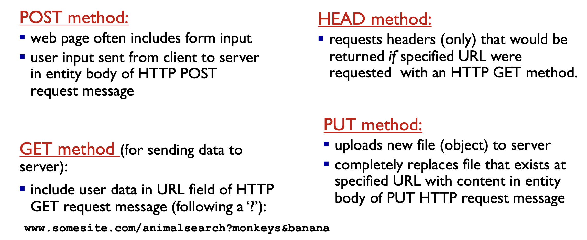

### HTTP response status codes
**200** OK
- request succeeded, requested object later in this message
  
**301 Moved Permanently**
- requested object moved

**400 Bad Request**
- request msg not understood by server

**404 Not Found**
- requested document not found on this server

### HTTP is all text
- A text-based header is easier for human beings to read and debug. Text-based headers are
also extensible.
- They are verbose (i.e., waste bandwidth) and harder to parse.
- makes protocol simple
- not the most efficient
  - "12345678" - 8 bytes
  - 12345678 - 4 bytes

## Maintaining user/server state: cookies
Web sites and client browser use **cookies** to maintain some state between transactions

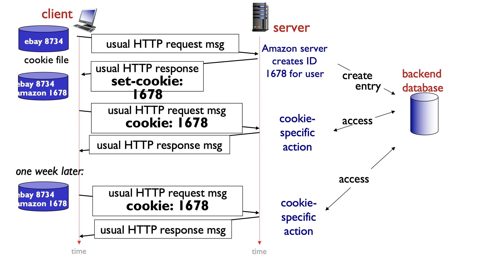

- authorisation
- shopping carts
- recommendations

**Cookies and Privacy**
- cookies permit sites to learn a lot about you on their site
- third party persistent cookies allow common identity to be tracket across multiple web sites

## Page Load Time (PLT)
Page Load Time (PLT) is an important metric
- from click (or typing url) until user sees page
- key measurement of web performance

Depends on many factors such as
- page content/structure,
- protocols involved and
- Network bandwidth and RTT

## Non-persistent HTTP (HTTP/1.0)
**Non-Persistent**: **One TCP connection** to fetch **one web resource** (connection then closed)
- downloading multiple objects requires multiple connections


**RTT** (Round trip time): time for a small packet to travel from client to server and back

- one RTT to initiate TCP connection
- one RTT for HTTP request and first few bytes to return
- file transmission time


## Non-persistent HTTP/1.0 response time formula

**1 Object Time** = Connection($1RTT$) + File($1RTT$) + file transmission time

**N Objects Time** = N(Connection($1RTT$) + File($1RTT$) + file transmission time)

### Concurrent Request and Responses (Possible solution to slow PLT)
- Use multiple connections in parallel
- Does not necessarily maintain order of responses

**Downsides**
- Too much overhead (so many different connections to server at once)

## Persistent HTTP (HTTP/1.1)
- server leaves TCP connection open after sending response
- subsequent HTTP messages between same client/server are sent over the same TCP connection

**Persistent without pipelineing**
- client issues new request only when previous response has been received
- one RTT for each referenced object

**Persistent pipelineing**
- introduced in HTTP/1.1
- client sends requests as soon as it encounters a referenced object
- as little as one RTT for all the referenced objects


<br>

**Better image to display persistent with pipelining**


- bold line 1 - base index file
- bold lines 2, 3, 4 - objects on page

1 RTT for connection, 1 RTT for index page, 1 RTT of 3 objects

## Non-Persistent HTTP/1.1 response time formula
**Index page** = Connection($1RTT$) + index($1RTT$)

**Index page** + N objects = Connection($1RTT$) + index($1RTT$) + N(object($1RTT$))

## Persistent HTTP/1.1 response time formula
**Index page** = Connection($1RTT$) + index($1RTT$)

**Index page + N objects** = Connection($1RTT$) + index($1RTT$) + objects($1RTT$)

## Downsides of HTTP 1.1
- server responds in **FCFS**(first-come-first-served scheduling) to `GET` requests
- small object may have to wait for transmission behind large object resulting in HOL(head of line) blocking


## HTTP/2: mitigating HOL blocking
- transmission order of requested objects based on client-specified
object priority (not always FCFS)
- divide objects into frames, schedule frames to mitigate HOL blocking

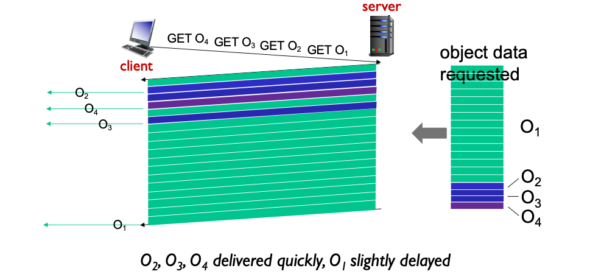

## Web caches: proxy server
Goal: satify client request without involving origin server

- user configures browser to point to a Web cache
- browser sends all HTTP requests to cache

```
if object in cache:
  cache returns cached object to client
else:
  cache requests object origin, then caches object then return
```

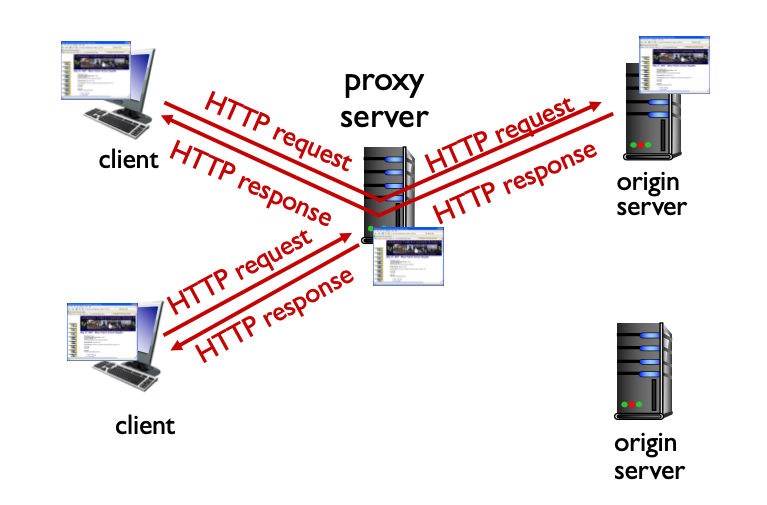

## Example: how caching improves speeds


**cache hit rate**: chance that the HTTP request is already stored in the local web cache

**LAN utilisation** = average data rate / LAN rate  
**Access link utilisation** = average data rate / access link rate

## Conditional `GET`: cache at client browser
Do not send object if cache has up-to-date cached version

- no object transmission delay
- lower link utilisation 

**cache**: specify date of cached copy in `HTTP` request  
- **If-modified-since: < date >**

**server**: response contains no object if cached copy is up-to-date:  
- **HTTP/1.0 304 Not Modified**

## Replication: improving HTTP 
Replicate popular Web site across many machines
- Spreads load on servers
- Places content closer to clients
- Helps when content isn’t cacheable

## CDN (Content Delivery Network): improving HTTP 
CDN: stores copies of content at CDN nodes
- Netflix stores copies of movies 

Subscriber requests content from CDN
- directed to nearby copy to retrieve content from

Caching and replication as a service, large-scale distributed storage infrastructure.

- Combination of (pull) client requests from cache and (push) cache requests from server
  - **Pull**: Direct result of clients’ requests
  - **Push**: Expectation of high access rate

## Electronic Mail
### User Agent (mail reader, Outlook, iPhone mail app)
- composing, editing, reading mail messages
- outgoing, incoming messages stored on server

### Mail Servers:
- **mailbox** contains incoming messages for user
- **message queue** of outgoing (to be sent) mail messages
- **SMTP protocol** between mail servers to send email messages
  - client: sending mail server
  - “server”: receiving mail server
  


### Properties
- uses **TCP** to reliably transfer email message from **client** (mail server initiating connection) **to server, port 25**
- **direct transfer**: sending server (acting like client) to receiving server
- **Three phases** of transfer:
  - handshaking (greeting)
  - transfer of messages
  - closure
- command/response interaction (like HTTP)
  - commands: ASCII text
  - response: status code and phrase
- messages (header & body) must be in **7-bit ASCI**

### Comparison with HTTP
- **HTTP**: pull based (client request), **SMTP**: push based (server request)
- Both have **ASCII** command/response interaction, **status codes**
- **HTTP**: each object encapsulated in its **own response message**, **SMTP**: multiple objects sent in **multipart message**
- SMTP uses **persistent** connections
- SMTP requires message 7-bit ASCII

**Format**

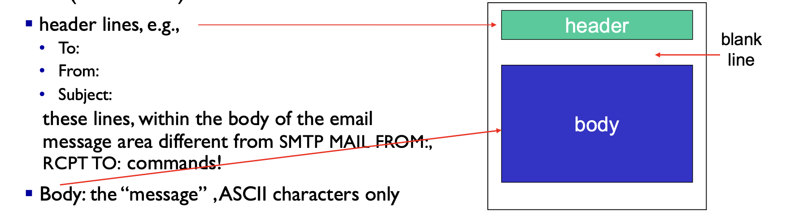

### Mail example:
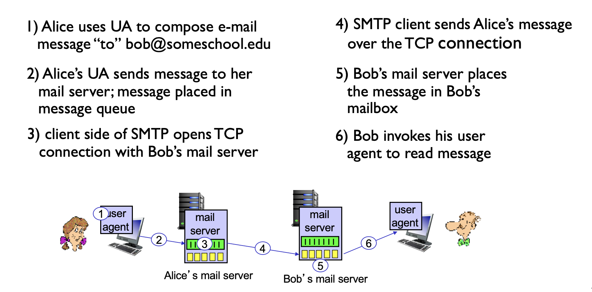

### Mail access protocol
- **SMTP**: delivery/storage of e-mail messages to receiver’s server  
- **IMAP**(Internet Mail Access Protocol): Provides retrieval, deletion, folders of stored messages on server
- **HTTP**: provides web-based interface on top of STMP (to send), IMAP to retrieve e-mail messages
  - gmail, Hotmail, Yahoo! Mail, etc. 

- **Note:** If the **client is user a web-based email** client like gmail on web the email is transmitted from to the server using **HTTP/HTTPS**.


## DNS: Domain Name System
- Maps hostname to IP address (32 bit) translation
- Initially all host-address mappings were in a hosts.txt file
  
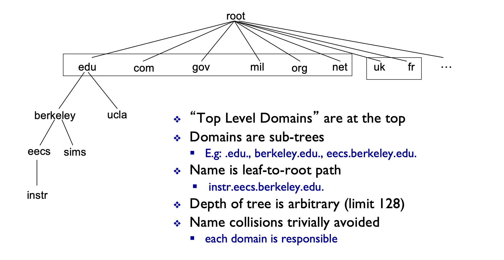

### Server Hierachy
  
**Top of hierarchy: Root servers**
- Location hardwired into other servers
- ICANN (Internet Corporation for Assigned Names and Numbers) manages root DNS domain
  
**Next Level: Top-level domain (TLD) servers**
- .com, .edu, etc. (several new TLDs introduced recently)
- Managed professionally

**Bottom Level: Authoritative DNS servers**
- Store the name-to-address mapping
- Maintained by the corresponding administrative authority

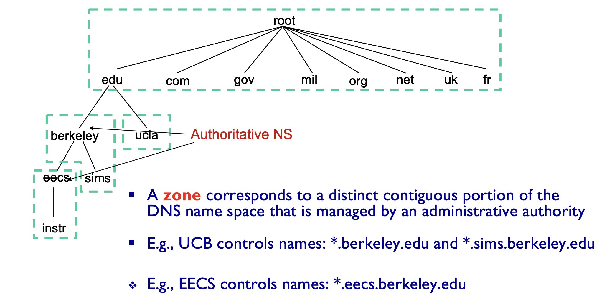

## Local DNS name servers
- Does not strictly belong to hierarchy
- Hosts learn about the local DNS server via a host configuration
protocol (DHCP)
- When host makes DNS query, query is sent to its local DNS server
  - local cache of recent name-to-address translation pairs 
  - acts as proxy, forwards query into hierarchy

## Iterated Query
- Implemented by Global DNS servers (the ones in hierachy)
  
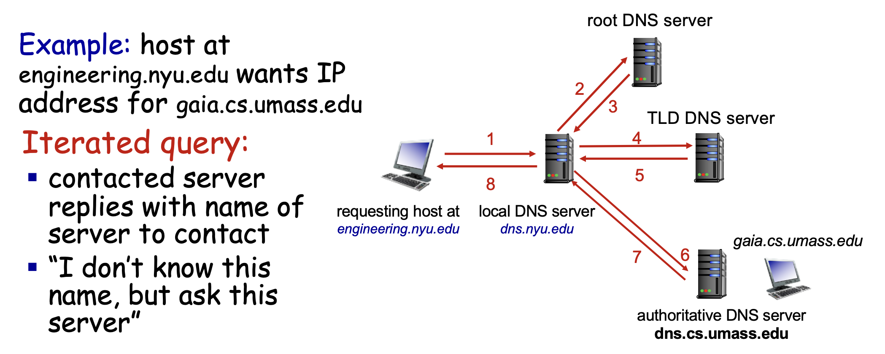

## Recursive Query
- Implemented by Local DNS server
  
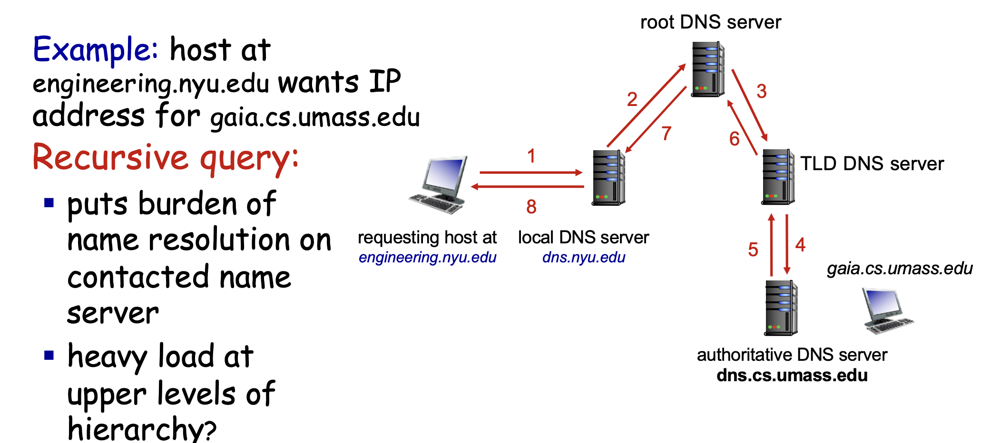

## Caching, Updating DNS Records
Once name server learns mapping, it **caches mapping**
- cache entries timeout (disappear) after some time (TTL)
- cached entries may be out -of -date
- Top Level Domain (TLD) servers typically cached in local name servers (root typically not visited)

## DNS Records
Distributed database storing **resource records (RR)**
- **RR** format: (name, value, type, ttl)
  
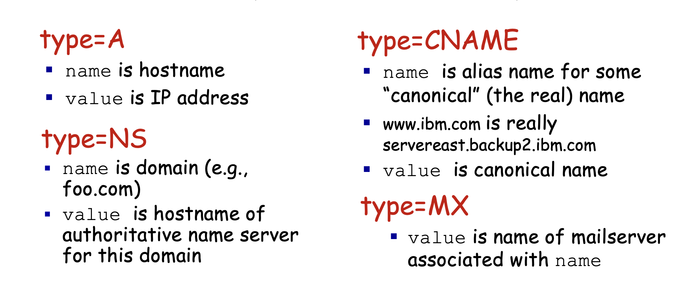

- **A** records provide a mapping from hostname to IP address.
  - (smtp.gmail.com, 108.177.125.10, XXX, 2 days)
  - (ns1.google.com, 216.239.32.10, XXX, 2 days)
  - (ns2.google.com, 216.239.34.1, XXX, 2 days)
- **MX** refers to the mail server record. 
  - (gmail.com, smtp.gmail.com, XXX, 2 days)
- **NS** refers to a name server record which provides the name of the nameserver responsible for the hostname/domain.
  - (ns1.google.com, 216.239.32.10, XXX, 2 days)
  - (ns2.google.com, 216.239.34.1, XXX, 2 days)
- **CNAME** refers to a canonical name record for the hostname.

### DNS protocol messages
DNS **query** and **reply** have the same format

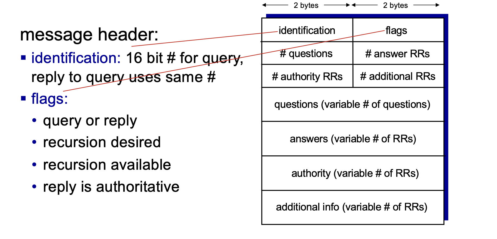
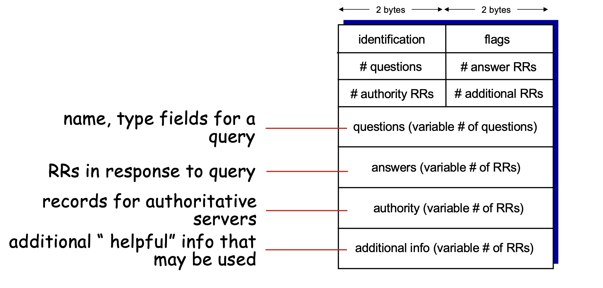

## Inserting into DNS Example
Register name **networkuptopia.com** at DNS registrar 
- provide names, IP addresses of authoritative name server (primary and
secondary)
- registrar inserts NS, A RRs into .com TLD server:
  - (networkutopia.com, dns1.networkutopia.com, NS)
  - (dns1.networkutopia.com, 212.212.212.1, A)

## DNS Reliability
- DNS servers are replicated (primary/secondary)
  - Name service available if at least one replica is up
- DNS uses port 53
- Usually, UDP used for queries
- Try alternate servers on timeout

## DNS Security
**DDOS**  
- Bombard root servers with traffic
  - not successful to date
  - local root servers cache IPs of Top level domain servers allowing bypass

**Redirect attacks**
- Man in the middle
  - intercept DNS queries
- DNS poisoning
  -  send bogus replies to DNS which caches

**Exploit DNS for DDoS**
- send queries with spoofed source address

## DNS Cache Poisoning


## Peer-peer architecture (P2P)
- no need for always-on server
- peers request service from other peers and provide servce in return to other peers
  - self scalability – new peers bring new service capacity
- peers are intermittently connected and change IP address
  
## Client Server: File distribution time formula
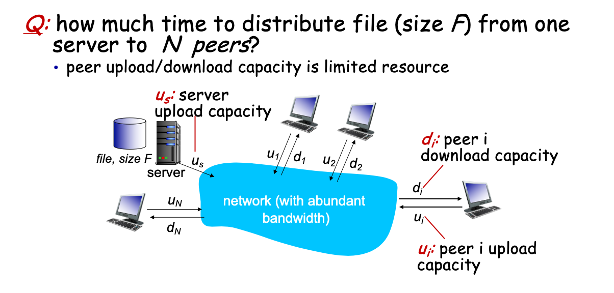

**Server transmission**  
Must sequentially send (upload) **$N$** file copies:
- time to send one copy: $\frac{F}{u_s}$
- time to send N copies: $N\frac{F}{u_s}$

**Client: each client must download file copy**
- $d_{min}$ = minimum client download rate
- Slowest client download time: $\frac{F}{d_{min}}$ 

**Time to distribute file $F$ to $N$ clients using client-server**  

$D_{cs} \geq$ max{$N\frac{F}{u_s}, \frac{F}{d_{min}}$}

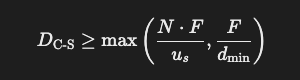

- $D_{cs}$ = time to distribute file (s)
- $N$ = Number of clients
- $F$ = File size (bits)
- $u_s$ = server upload speed (bits/s)
- $d_{min}$ = minimum client download speed (b/s)

## P2P: File distribution time formula


**Server transmission**  
Must sequentially send (upload) one file copy:
- time to send one copy: $\frac{F}{u_s}$

**Client: each client must download file copy**
- $d_{min}$ = minimum client download rate
- Slowest client download time: $\frac{F}{d_{min}}$ 

**Time to distribute file $F$ to $N$ clients using P2P**  

**$D_{P2P} \geq$ max{ $\frac{F}{u_s}, \frac{F}{d_{min}}$, $\frac{NF}{u_s + \Sigma u_i}$ }**

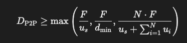

- $D_{P2P}$ = time to distribute file (s)
- $F$ = File size (bits)
- $u_s$ = server upload speed (bits/s)
- $d_{min}$ = minimum client download speed (b/s)
- $N$ = Number of clients
- $u_i$ = upload speed of $i$th client (b/s)

## Client-Server vs P2P time

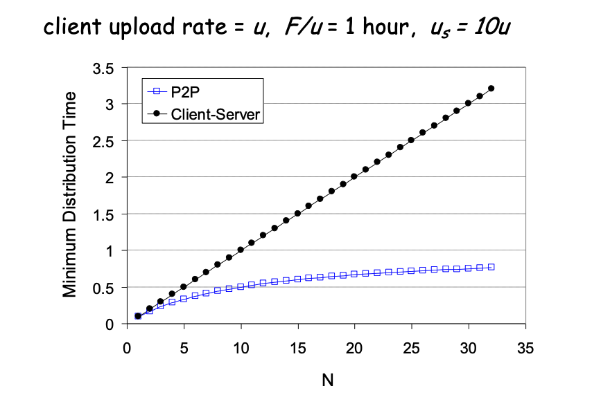

### Example: BitTorrent
- peers in torrent send/receive file chunks

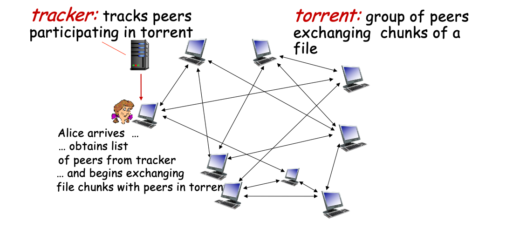

**Requesting chunks**

- At any given time, different peers have different subsets of file
- Peers ask fellow peers what chunks they have
- Peers request for missing chunks **rarest** first

**Sending chunks (tit-for-tat)**  
Peer sends chunks to four peers currently sending chunks at highest rate
- re-evaluate top 4 every 10 secs
- every 30 secs: randomly select another peer, starts sending chunks (even if peer is not uploading data)
  - "optimistic unchoke” this peer
  - newly chosen peer may join top 4

## Video Streaming
**Videos**: sequence of image displayed at constant rate  
**Image**: array of pixels (each pixel is a bit)

Solution: use redudancy (repeated elements) within the between images to decrease number of bits used

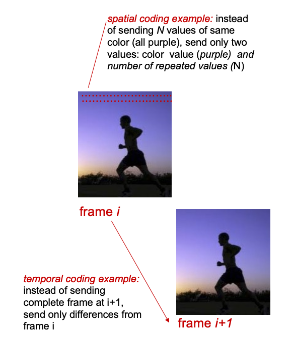

## DASH: Dynamic, Adaptive, Streaming over HTTP
**Server**

- divides video into multiple chunks
- each chunck stored, encoded at different rates
- **manifest file**: URL for different chunks

**Client**

- periodically measures server-to-client bandwidth
- consulting manifest, requests one chunk at a time

**Streaming Video = encoding + DASH + playout buffering**


# Transport Layer
## Transport services and Protocols
- **logical communication** between application processes running on different hosts
- **sender**: breaks applications messages into segments 
- **receiver**: reassembles segments into messages
- Protocols available: TCP, UDP

## Highlevel: TCP and UDP
**TCP:** Transmission Control Protocol
- reliable, **in-order delivery**
- congestion control
- flow control
- connection setup

**UDP:** User Datagram Protocol
- unreliable, unordered delivery
- faster than TCP (used for VOIP)
- no delay or bandwidth guarantees

## Multiplexing and Demultiplexing
**Multiplexing (Sender):** Combining data from multiple applications into one stream for transmission, with headers added to identify each data source.  
**Demultiplexing (Receiver):** Separating incoming data and directing it to the correct application based on header information.

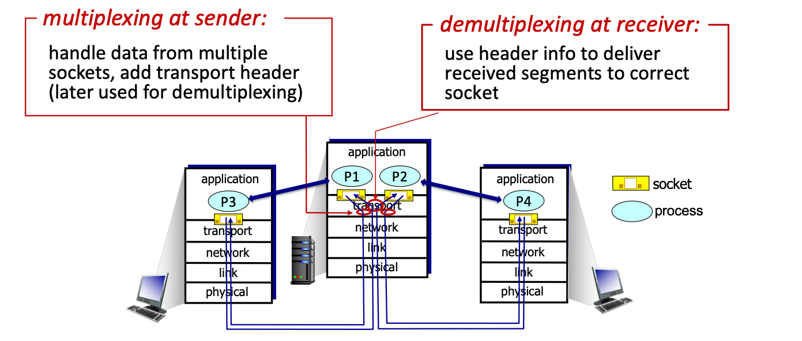

### UDP -  Connectionless demultiplexing
When host receives UDP segment:
- Contains destination **IP**and **port number**
- Checks **destination port number** in segment and directs UDP segment to **socket** with that port number.
- UDP datagrams with **same destination port** but different source IP will be directed to **same socket at host**.

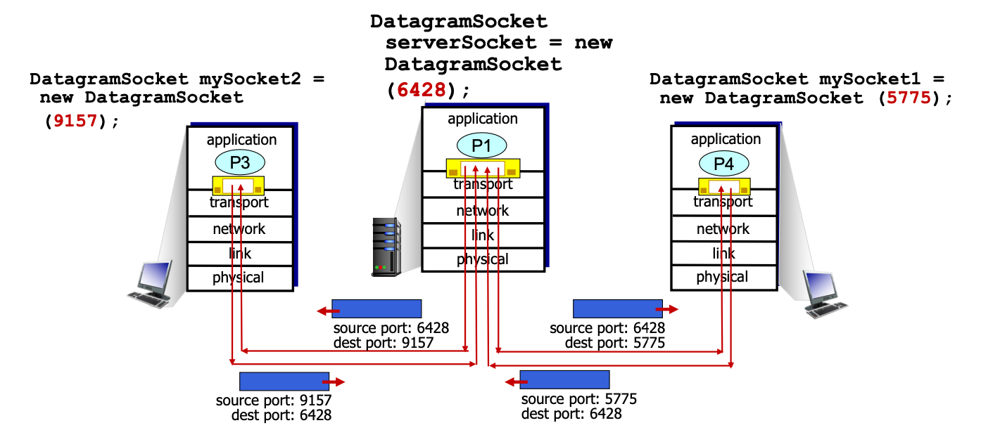

### TCP -  Connection demultiplexing
TCP socket identified by 4-tuple:
- source IP address
- source port number
- destination IP address
- destination port number

Demux: receiver uses all four values to direct segment to appropriate socket.

- The server has a welcoming (listening) socket, which is used to accept incoming client connections. 
- A new socket is opened for each connection (even if same port is specified unlike UDP).

**X = 80** in image below

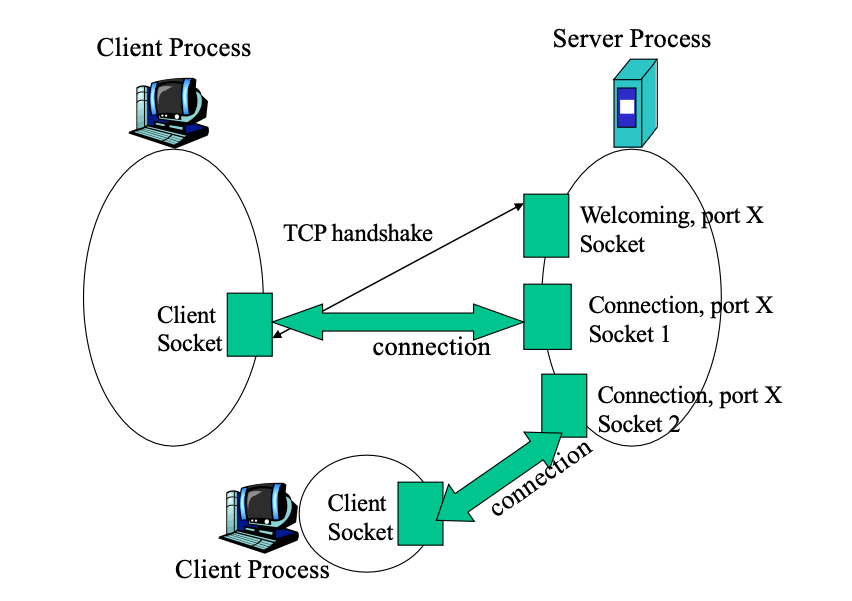
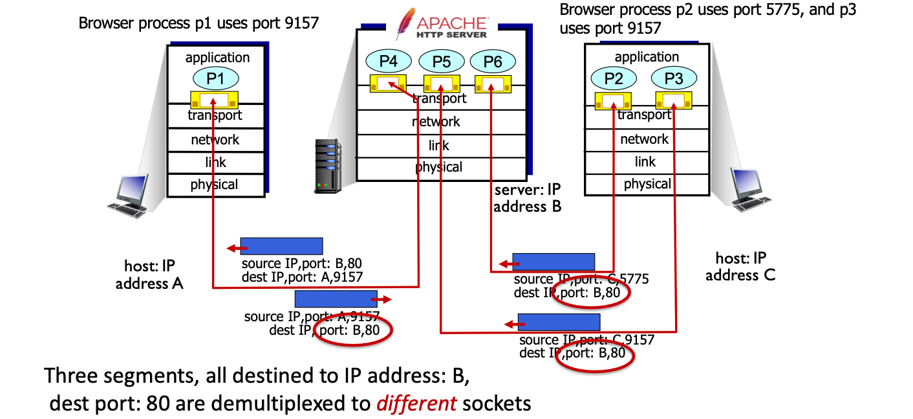

- UDP: demultiplexing using destination IP and port number
(only)
- TCP: demultiplexing using 4-tuple: source and destination IP
addresses, and port numbers

## UDP: User Datagram Protocol
Internet transport protocol with best-effort service so segments may be:
- lost
- delivered out-of-order to app

**Connectionless**
- **no handshaking** between sender and receiver (no RTT delay)
- no connection state at sender, receiver
- small header size
- no congestion control
  - UDP can still transport if network is congested
- each UDP segment handled indepdendently of others

**Applications that use UDP**
- DNS
- SNMP (network management)
- HTTP/3

If reliable transfer needed over UDP:
- add reliability **at application layer**
- add congestion control **at application layer**

### UDP: Transport Layer Actions
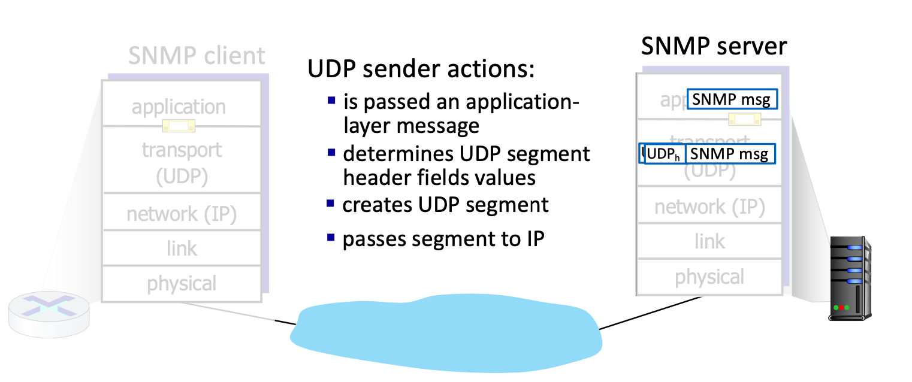
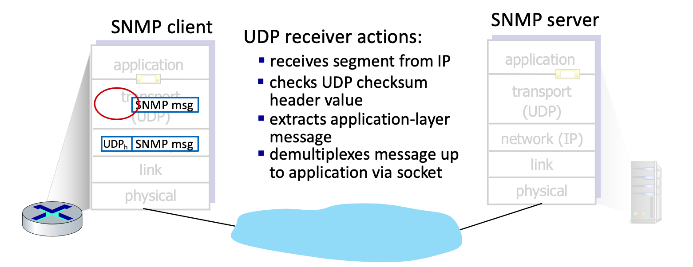

### UDP segment format
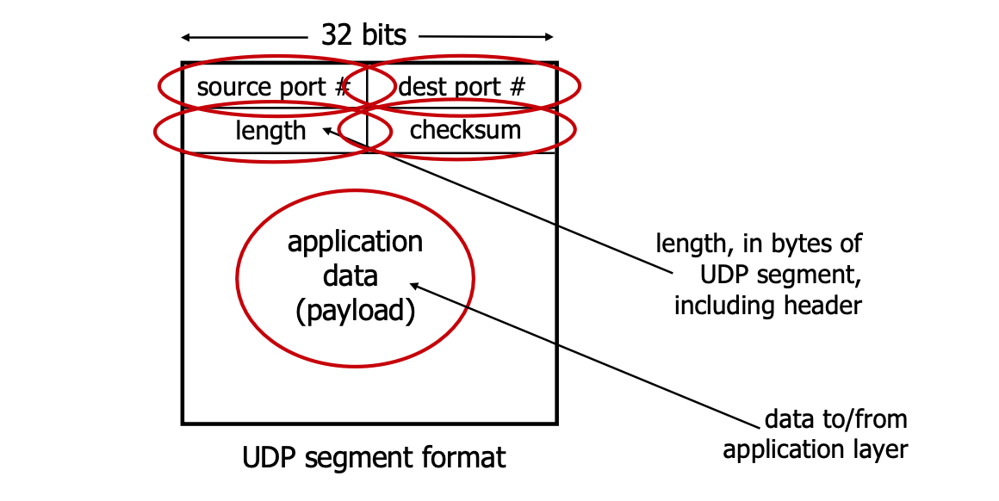

### UDP Checksum
Detect errors (flipped bits) in transmitted segment
- Treat content of UDP segment as sequence of 16-bit integers and check **sum of transmitted = sum of received**

Transmitted: 5 + 6 = 11  
Received: 4 + 6 = 10  
11 $\neq$ 10, so there was a error. 


### Checksum Example
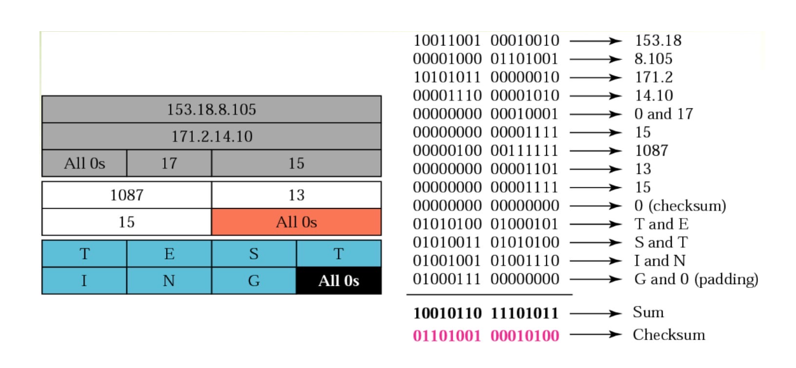

At the receiver, when adding all the values together the result should be a 16-bit sequence of **All 1s** (result of using 1's complement, adding the last two line in the image above). The receiver uses an `AND` gate so result is 1, otherwise there was an error (bit flip).

## Reliable data transfer
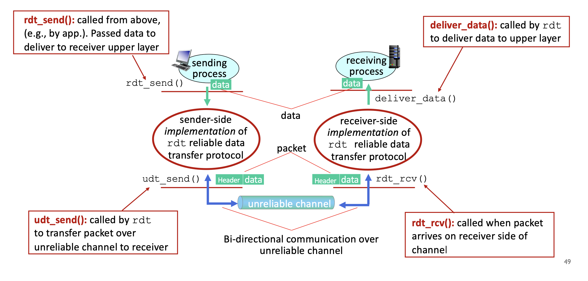

## rdt 1.0 reliable transfer over a reliable channel
underlying channel perfectly reliable
- no bit errors
- no loss of packets
- no out of order delivery
  
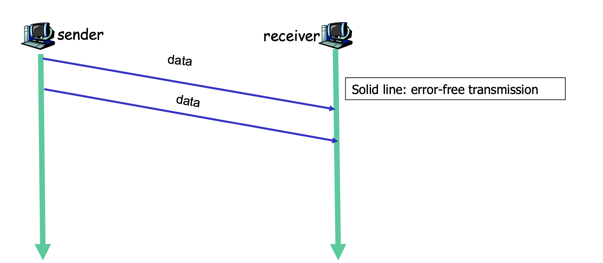

## rdt2.0: channel with bit errors
underlying channel may flip bits in packet
- **checksum** used to detect bit errors at receiver.

**How do we recover from detected errors?**
- **acknowledgements (ACK)**: receiver explicitly tells sender that packet received OK.
- **negative acknowledgements (NACK)**: receiver explicitly tells sender that packet had errors.
- sender retransmits packet on receipt of NACK

**STOP AND WAIT**: sender sends one packet, then waits for receiver response.

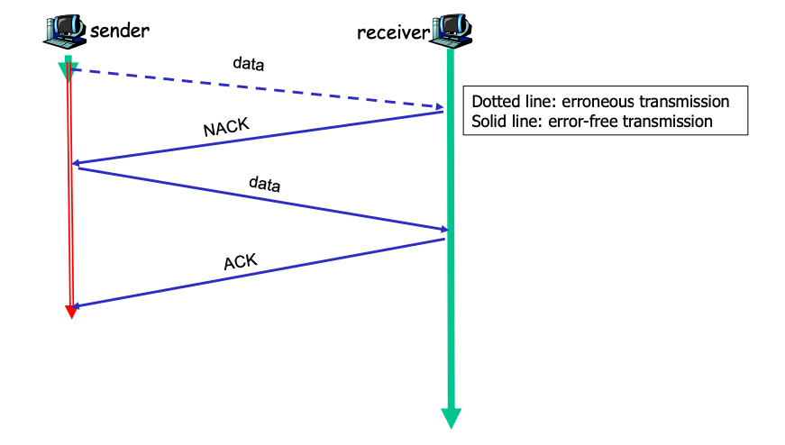


### Flaw with rdt2.0
Both ACK/NACK can be corrupted. Sender retransmisted current packet if ACK/NACK is corrupted.

## rdt2.1 

**Sender**:
- Sequence number # added to each packet.
- Two sequence numbers: #0 or #1.
- must check if received ACK/NACK is corrupted.

**Receiver**:
- Must check if received packet is duplicated.
- Receiver does not know if its last ACK/NACK received OK at sender.

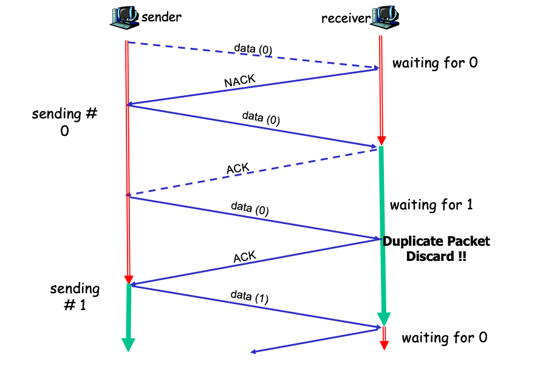

## rdt2.2: a NACK-free protocol
same functionality as rdt2.1, using **ACKs only**
- instead of NACK, receiver sends ACK for last packet received OK
  - receiver must explicitly include seq# of packet being ACKed
- duplicate ACK at sender results in a retransmit current packet.
  
As we will see, TCP uses this approach to be NACK-free.

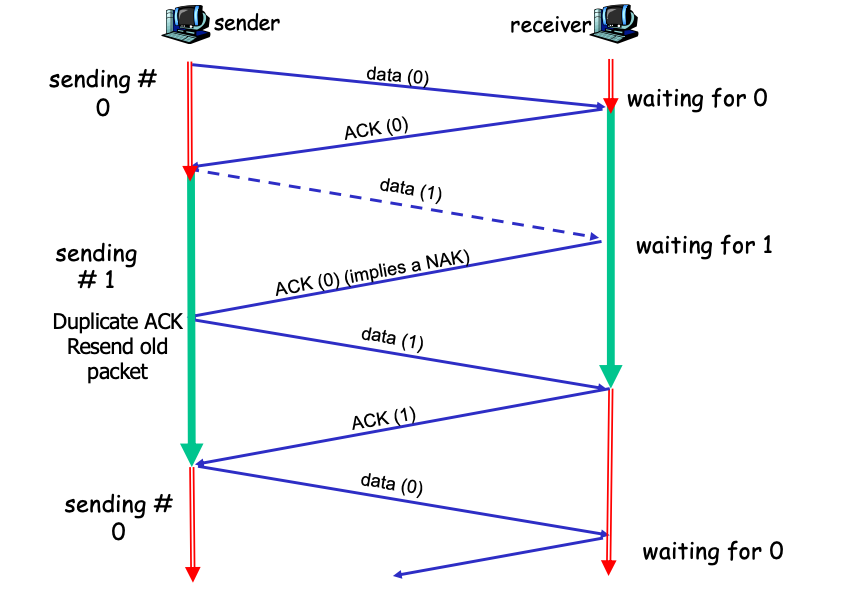

## rdt3.0: channels with errors **and loss**
underlying channel can also lose packets (data, ACKs), not just bit flip errors.

**Solution**: 
Sender waits **“reasonable” amount of time** for ACK
- Automatic retransmit if no ACK received in this time.
- If pkt (or ACK) just delayed (not lost):
  - retransmission will be duplicate, seq#s handles this.

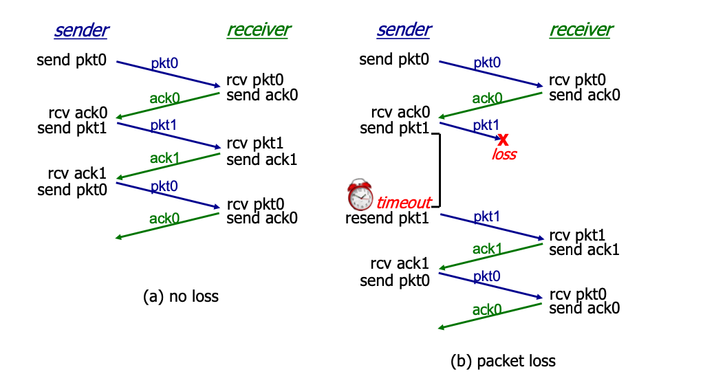
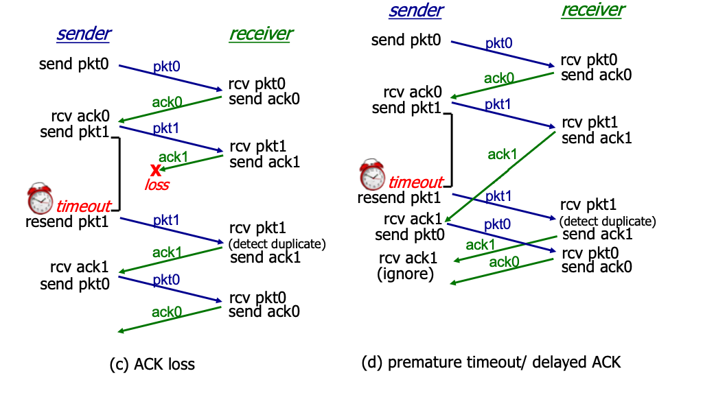

### Performance of rdt3.0 (stop and wait)
$U_{sender}$: utilisation – fraction of time sender busy sending

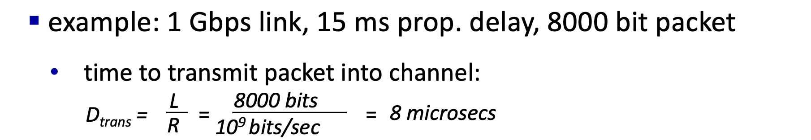

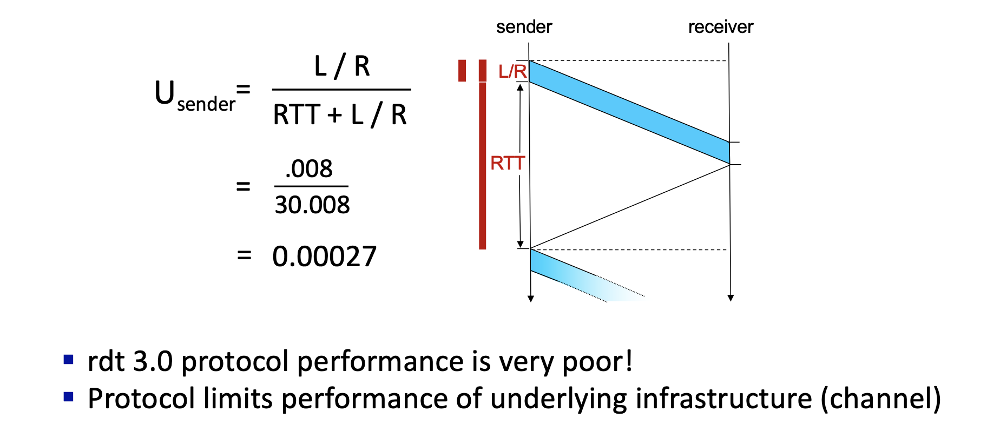

## Channel utilisation formula
$U_{sender} = x * \frac{\frac{L}{R}}{RTT + \frac{L}{R}}$  

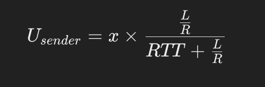

$x$ = windows size  
$L$ = length of packet (bits)  
$R$ = bandwidth (bits/sec)  
$RTT$ = round trip time (sec)

## rdt3.0: pipelined protocols operation
**pipelining**: sender allows multiple, “in-flight”, yet-to-be-acknowledged
packets
- range of sequence numbers must be increased
- buffering at sender and/or receiver

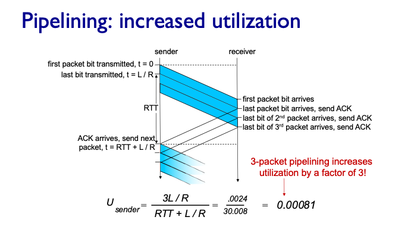

## Go-Back-N: sender
- Sender: window of up to N, consecutive transmitted but **unACKed** packets 
  
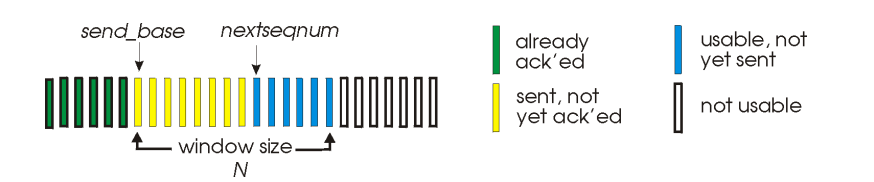

- **cumulative ACK**: ACK(n): ACKs all packets up to, including seq # n
  - on receiving ACK(n): move window forward to begin at n+1
- only maintains a **timer for oldest in-flight packet**
- timeout(n): retransmit packet n and all higher seq # packets in window

## Go-Back-N: receiver
- Receiver: window size of 1. 
- Always send ACK for packet with highest **in-order** seq# successfully received so far.
  - only need to remember `rcv_base` (represents the sequence # of the earliest byte that has not yet been acknowledged by the receiver)

- on receipt of out-of-order packet:
  - can discard (no buffer) or buffer: an implementation decision
  - re-ACK packet with highest **in-order** seq#

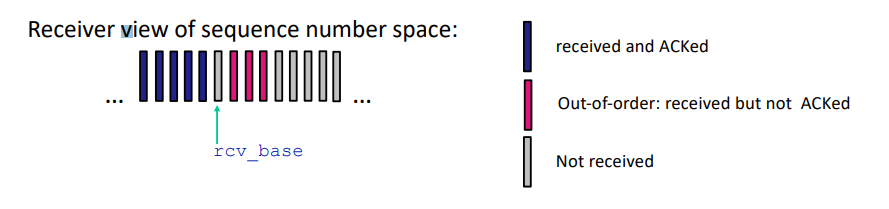

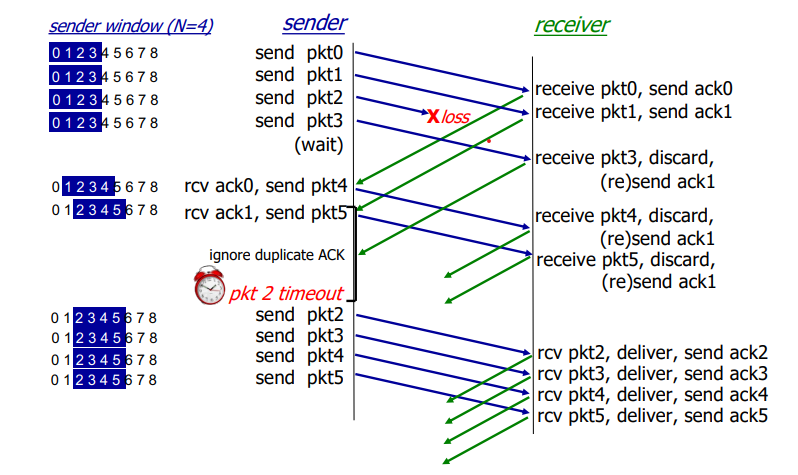

- ACK number is the sequence number of the last in-order packet that has been correctly received.

## Selective repeat
- Receiver individually acknowledges all correctly received packets
  - buffers packets, as needed
- Individual timer for each unACKed packet within the sender’s window.
  - sender times-out/retransmits individually for unACKed packets
- sender window
  - N consecutive seq #s
  - limits seq #s of sent, unACKed packets
  
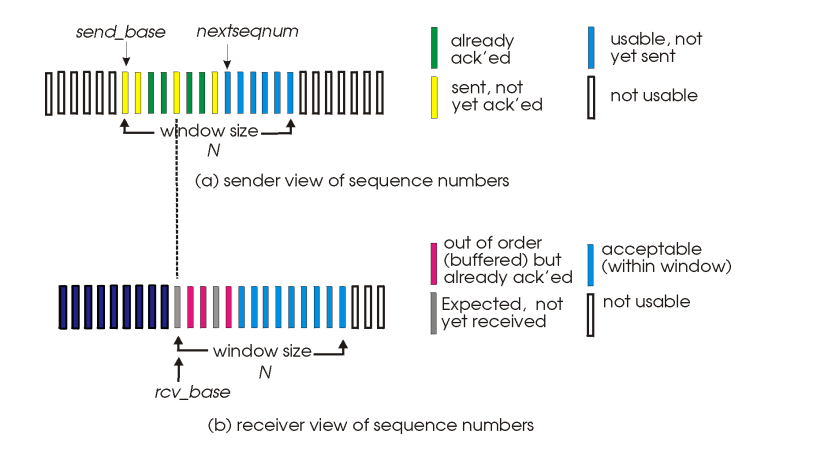
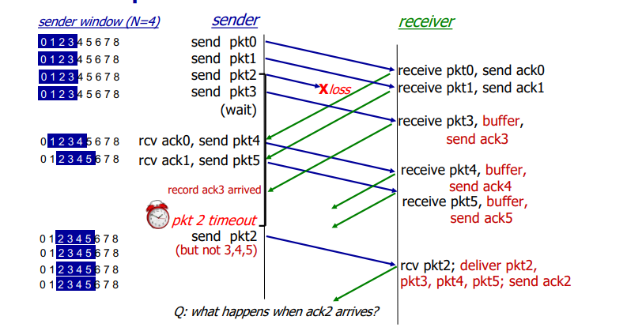

- ACK number is the sequence number of the last in-order packet that has been correctly received.
- When ACK2 arrives, since ACK3 already arrived before it the window becomes [4,5,6,7]

## Selective repeat problem
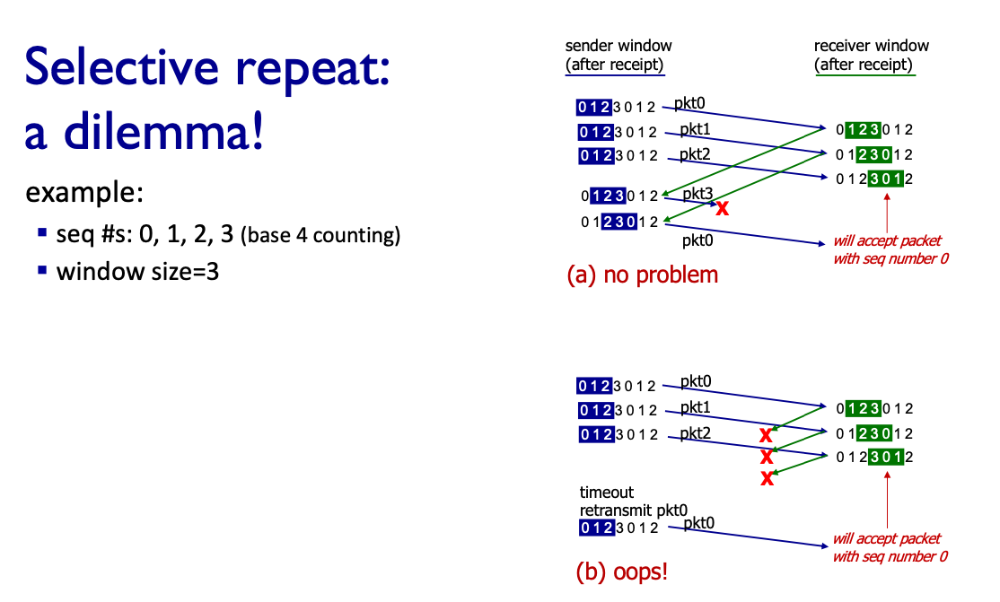

a) No issues since receiver recognises **pk3 is lost** and new pk0 is buffered (since it is in the receivers current window) until **pk3** is retransmitted and received.

b) Issue because the receiver window is already contains **new pk0**, however the **old pk0** is retransmitted since it there was no **ack1 was lost**.

### Solution to selective repeat problem
Sender window size $\leq \frac{1}{2}$ sequence number space. The maximum sequence number formula: $2^n / 2$, where $n$ = num bits

- The sequence number space is 4 (0, 1, 2, 3). So window size $\leq$ 2

## Connection-oriented transport: TCP

## TCP Header
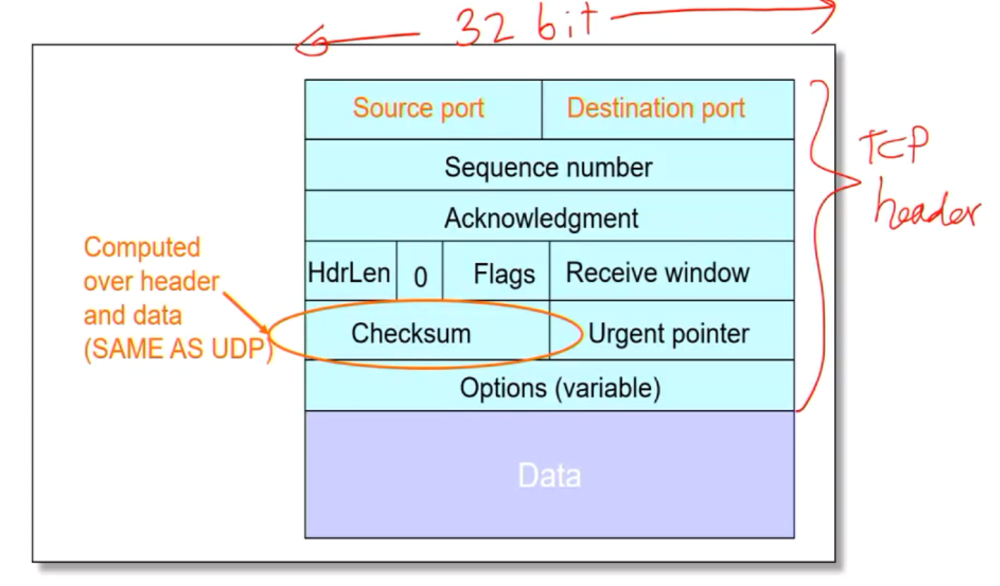

- Sequence number can be up to 32 bits, which represents up to $2^{32}$ numbers $\approx$ 4 billion 
- **HdrLen = Header Length** (required since header length not fixed, but rarely changes)
  - Min length = 20 bytes (most common), Max length = 60 bytes
- **Checksum**: computer over header and data

## TCP Sequence number are byte offsets
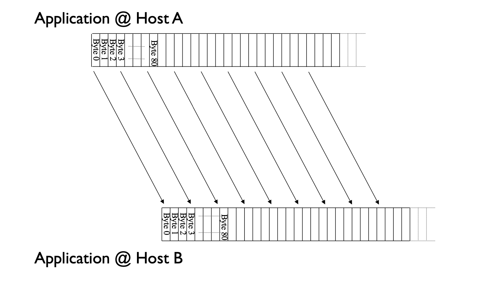
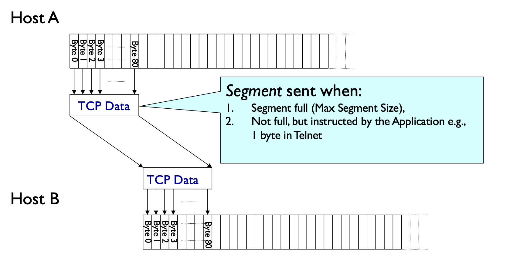

### TCP Maximum Segment size
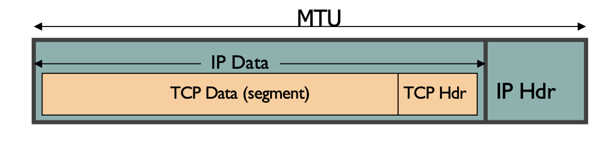

**MSS = MTU - 20 (IP header) - 20 (TCP header)** (ONLY TCP payload, no TCP header, no IP header)

- IP Packet
  - **IP Packet = IP header + IP segment/payload (TCP Packet)**
  - No bigger than Maximum Transmission Unit (**MTU**) of link layer
  - Example: 1500 bytes for Ethernet
- TCP packet
  - **TCP Packet = TCP Header + TCP segment/payload (Application layer data)**
  - 20 bytes $\leq$ TCP header $\leq$ 60 bytes (generally is 20 bytes)
- TCP segment/payload
  - No more than maximum segment size (**MSS**) bytes
  - Up to 1460 consecutive bytes from the stream

### TCP Sequence Numbers
**ISN = Initial sequence number** (not 0)

- Sequence number = ISN + k bytes
- ACK sequence number = Sequence number + TCP Data Length (not header)
  
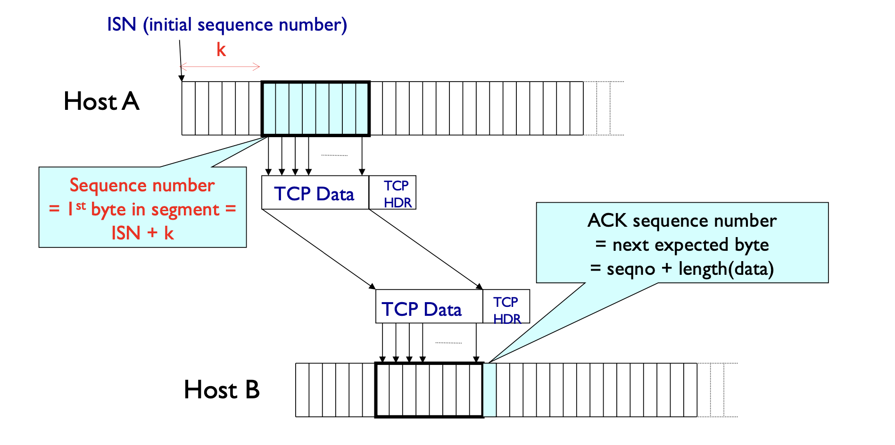

### Why chose random ISN
-  Avoids ambiguity with back-to-back connections between same end-points.
-  Potential security issue if the ISN is known.

## Cumulative Sequence Acknowledgements
ACK number represents the next expected byte (or packet) in the sequence. The ACK number is the highest in-order byte sequence number + 1.

**Scenario 1**

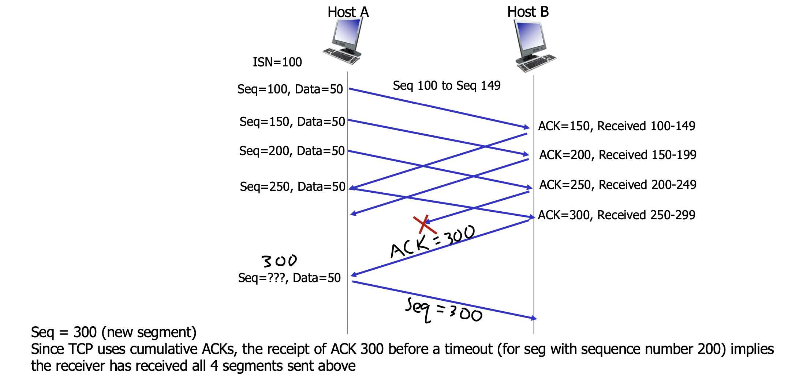

**Scenario 2**

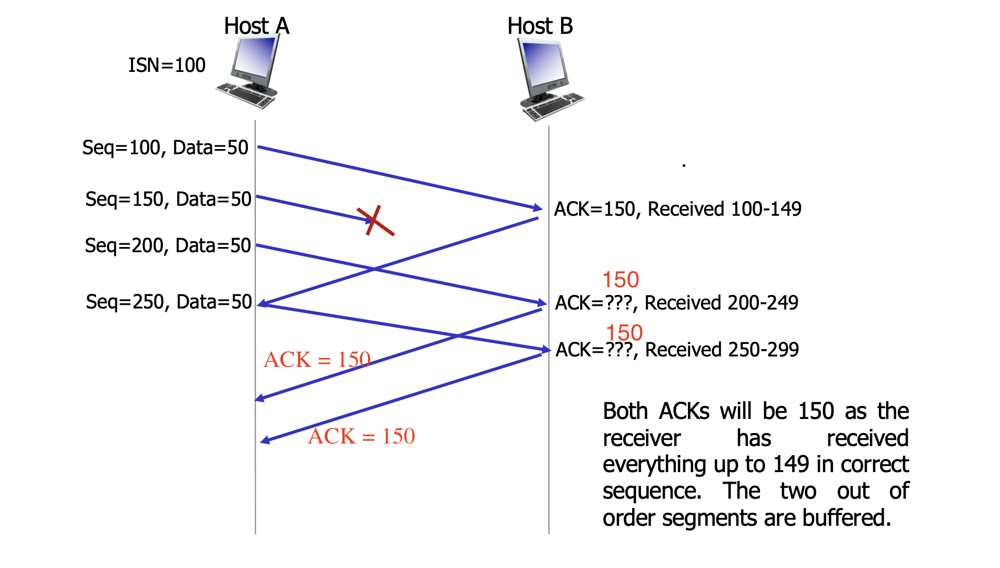

200 - 249 and 250 - 299 are buffered until 150 - 199 is received.

### Tutorial Example
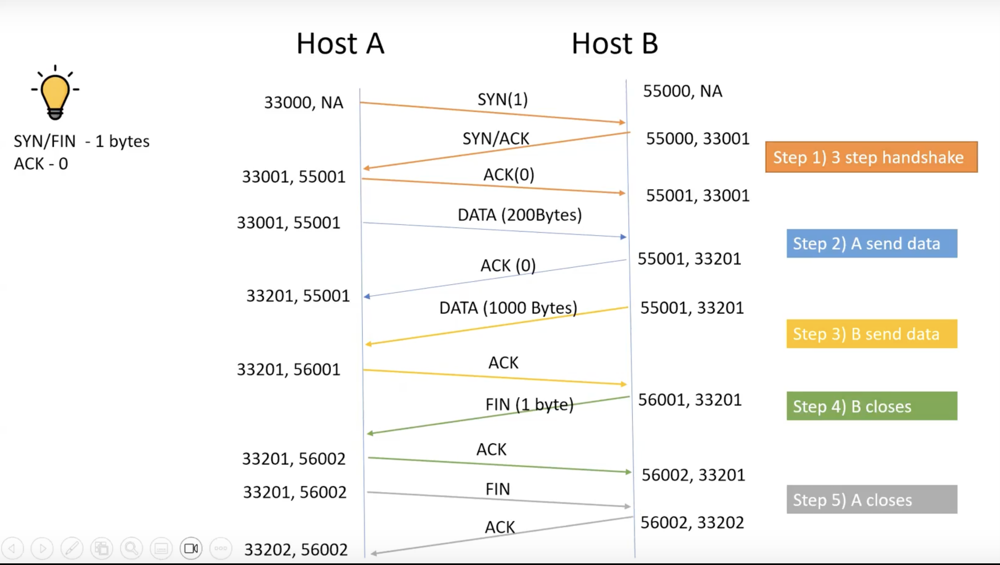

## Piggybacking (both sides send and transmit)
Both client and server send and receive data.


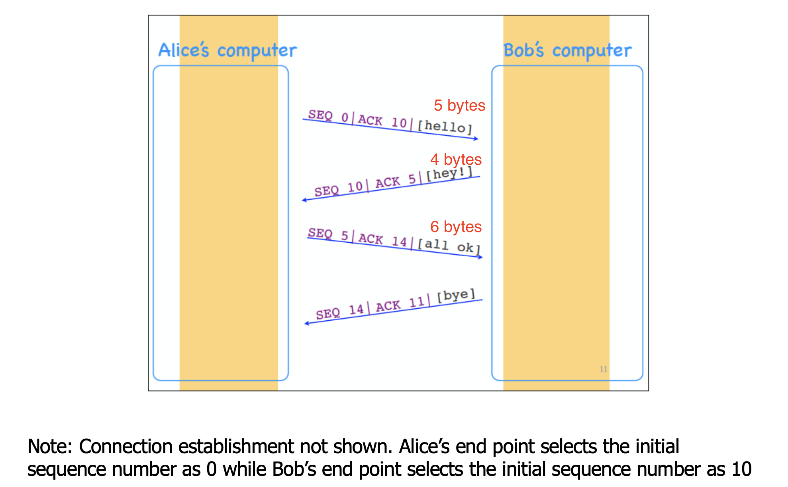
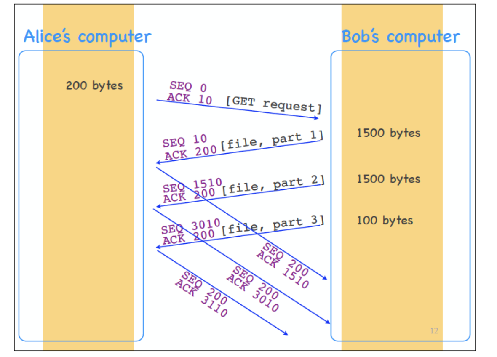

**Binary conversions**
- 1 KB = 1024 b
- 1 MB = 1024 KB
- 1 kbps (kilo bit per second) = 1000 bps (bits per second)

## TCP RTT Timeout Formulas
**SampleRTT** = measured time from segment transmission until ACK
- this will vary, so instead we want an estimated RTT 

**EstimatedRTT = (1 - $\alpha$) $\times$ EstimatedRTT(k) + $\alpha$ $\times$ SampleRTT**

- exponential weighted moving average (EWMA)
- influcent of past sample decreases exponentially faster
- typical value $\alpha$ = 0.125

**DevRTT = (1 - $\beta$) $\times$ DevRTT(k) + $\beta$ $\times$ |SampleRTT(k) - EstimatedRTT(k)|**
- EWMA of SampleRTT deviation from EstimatedRTT
- typically, $\beta$ = 0.25 

**TimeoutInterval = EstimatedRTT + 4$\times$DevRTT**

### Exclude retransmissions in RTT computation
- Sender cannot differentiate between original ACK and retransmission ACK
- **RTT = Final ACK - Original transmission**

## TCP rdt
- TCP uses a combination of go-back-N and selective repeat
- TCP uses a single timer for the oldest unacknowledged segment.
- The receiver employs a delayed ACK mechanism.
- Retransmit packets upon timer timeout events
- TCP uses cumulative acknowledgements
- Sender retransmits a segment when it receives triple duplicate ACKs 

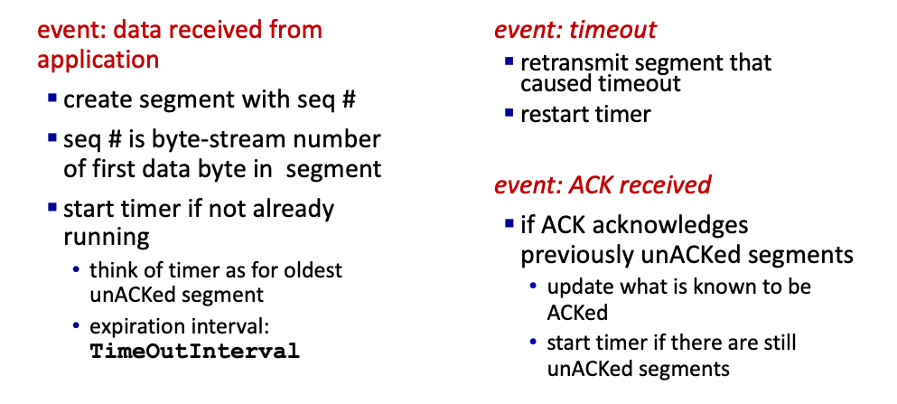

### Delayed ACKs
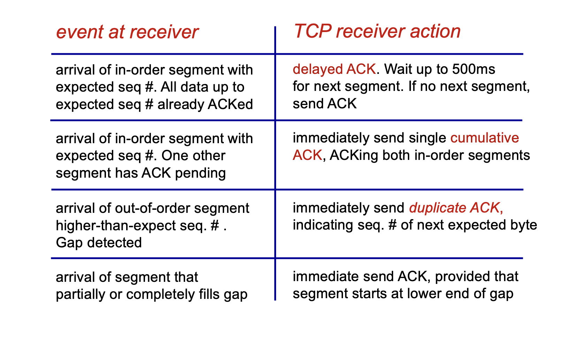

### Retransmission scenarios
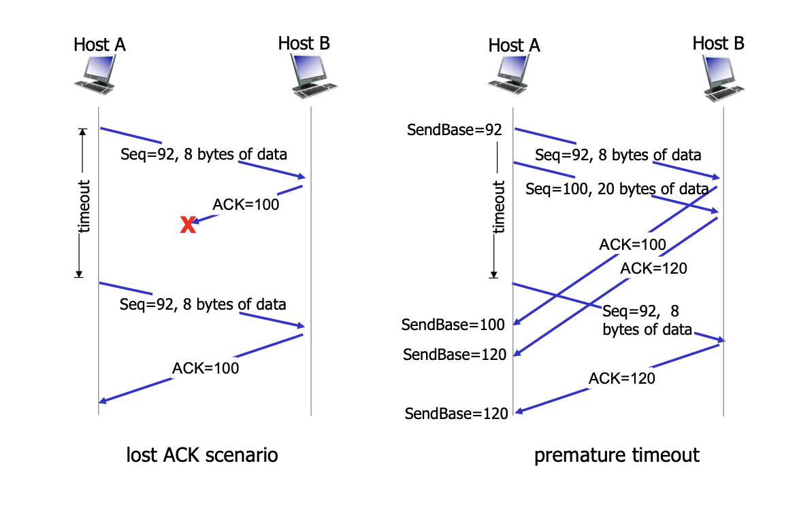
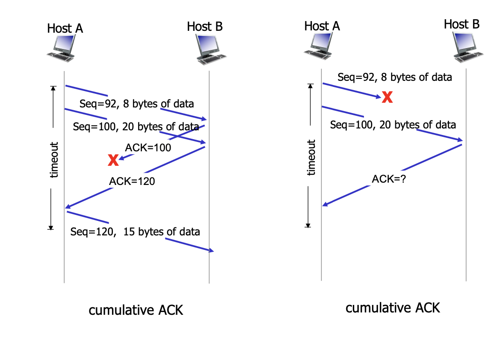

ACK = 92 in last image

## TCP Fast retransmit

 
Note: 3 additionaly so 4th ACK.

## Flow Control
Receiver controls sender, so sender won’t overflow receiver’s buffer by transmitting too much, too fast. (Fast computer does not want to overwhelem slow computer like a phone).

In TCP, window size is NOT fixed, it is **adaptive**, it controls the number of packets that can be sent out without waiting for an ACK. Adjusting the window size helps with flow control. 

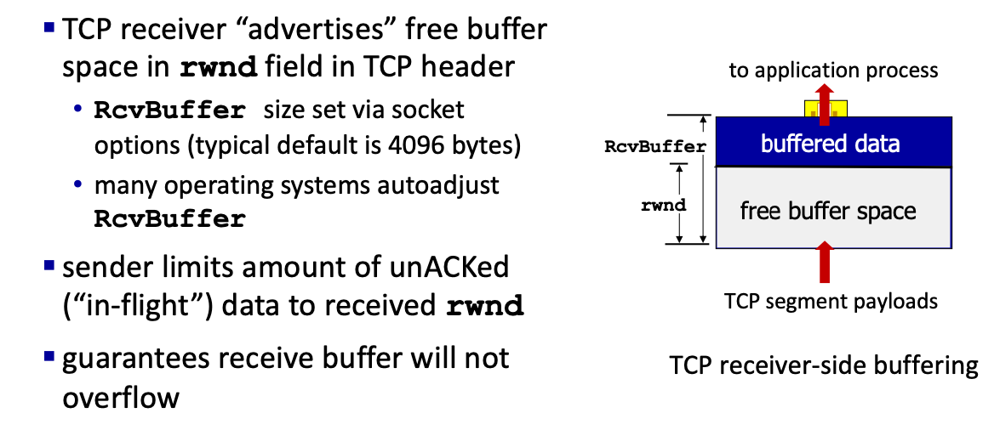

**rwnd** = receiver window size

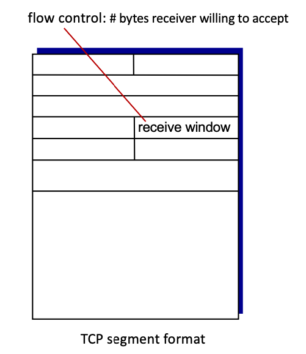

If **rwnd = 0**, then
- Sender would stop sending data
- Eventually the receive buffer would have space when the application process reads some bytes

Sender keeps sending TCP segments with one data byte to the receiver
- These segments are dropped but acknowledged by the receiver
with a zero-window size
- Eventually when the buffer empties, non-zero window is advertised

## Connection Management
Before exchanging data, sender/receiver “handshake”:
- agree to establish connection (each knowing the other willing to establish connection)
- agree on connection parameters (starting seq numbers)

## TCP-3 way Handshake
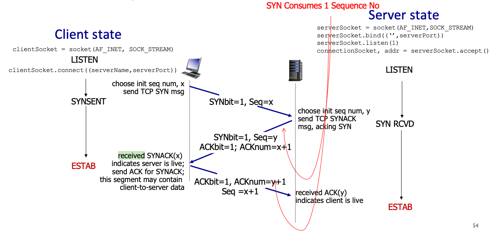

**Important:** SYN and FIN flag bits consume 1 sequence number (acts as 1 byte)

### What happens if the SYN gets lost?
 Suppose the SYN packet gets lost
- Packet is lost inside the network, 
- Server discards the packet (e.g., it’s too busy) 
 
Eventually, no SYN-ACK arrives
- Sender sets a timer and waits for the SYN-ACK
- … and retransmits the SYN if needed

## Types of Terminations

### One at a time termination
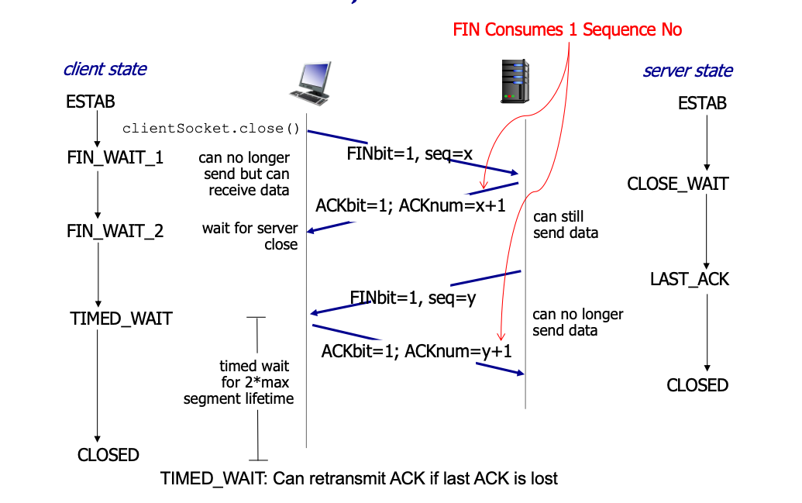

Individual FINs and ACKs

### Both together termination


FIN + ACK together from the server

### Simultaneous termination
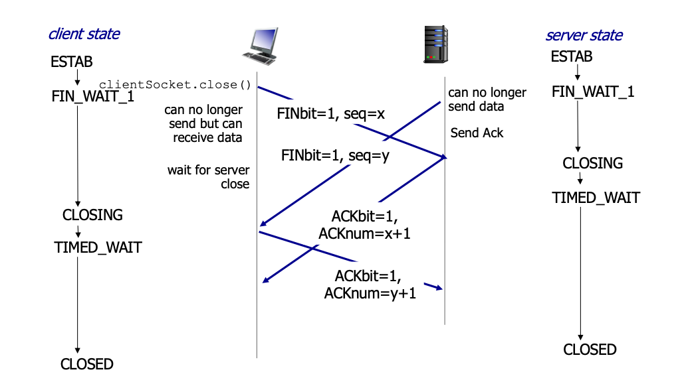

FINs sent at the exact same time

## Abrupt Termination
When the client/server suddenly crashes you need to send a **RST** (Reset) flag.
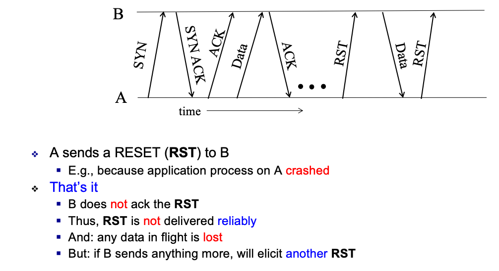

## Congestion Control
Too many sources sending too much data too fast for network to handle. (Two fast super computers sending data to each other but the network is congested)

### Cost of congestion
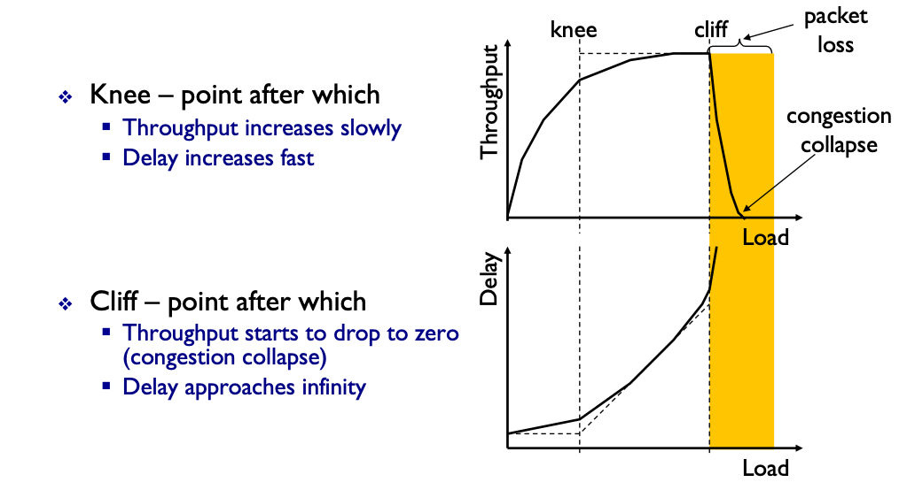

- Throughput slows down as load increases. 
- Delay increases exponentially as loads increase.

### Approaches towards congestion control
**End-end congestion control**  
Design algorithms that can infer the congestion level of the network which dynamically controls the rate of data injected into the network.

**Network-assisted**  
Monitoring tools inside router to sense buffer size and communicate with all devices if the router is congested. Problem with this is notifying the senders of the buffer size (millions of senders).

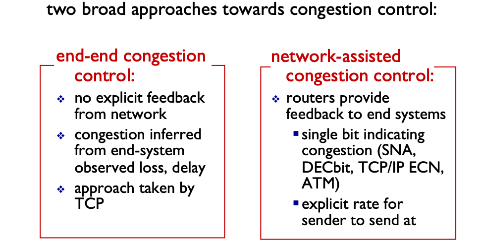

## TCP’s Approach to congestion control
**Vary window size to control sending rate**
- TCP connection maintains a window and controls the number of in-flight packets.
- TCP sending rate: send **cwnd** (congestion window) bytes, wait for RTT for ACKs, then send more bytes.
  
Rate $\approx \frac{cwnd}{RTT}$ bytes/sec

## Flow control vs Congestion controls
Flow control window: **Advertised / Receive Window (RWND)**
- How many bytes can be sent without overflowing receiver’s buffers
- Determined by the receiver and reported to the sender

Congestion Window: **CWND**
- How many bytes can be sent without overflowing routers
- Computed by the sender using congestion control algorithm

Sender-side window = **minimum {CWND, RWND}**
- Assume for this discussion that RWND >> CWND

### CWND
CWND has units in bytes, however for purpose of lecture, the units used is MSS (Max segment size, the amount of payload data in TCP).

## Congestion Detection

**Duplicate ACKs: isolated loss**
- dup ACKs indicate network capable of delivering some segments
  
This means packets subsequent packets after the lost packet has been delivered successfully.  Congestion status is the **network is midly congested**.
 
**Timeout: much more serious**
- Not enough dup ACKs
- Must have suffered several losses
  
Subsequent packets are also lost. Congestion status is **seriously congested**.

## Rate adjustment
Basic structure:
- Upon receipt of ACK (of new data): increase rate
- Upon detection of loss: decrease rate
  
How we increase/decrease the rate depends on the phase of congestion control we’re in:
- Discovering available bottleneck bandwidth vs.
- Adjusting to bandwidth variations

## TCP Slow Start (Bandwidth discovery) 


## AIMD (Additive increase multiplicative decrease)
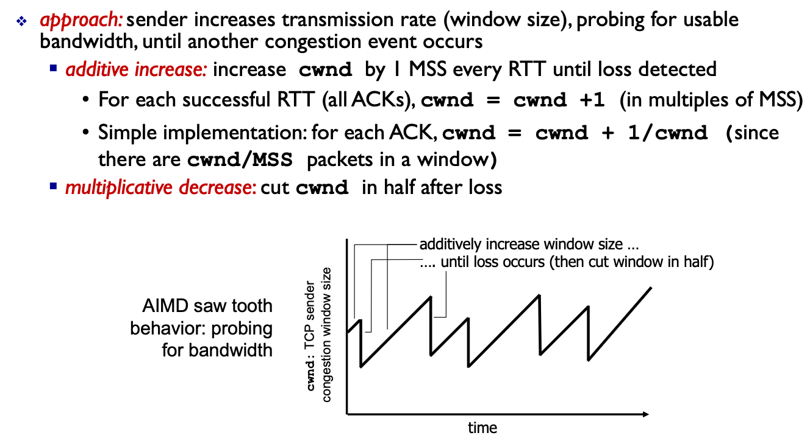

- Successful = linear increase
- Unsuccessful = factored decrease

## Slow Start Threshold (ssthresh)
- Introduce a “slow start threshold” **(ssthresh)**
  - Initialised to a large value (value on graph when expoential ends)
- Convert from Slow start to AIMD when **CWND = ssthresh**
  - On loss, **ssthresh = CWND/2**


## Events that cause CWND to change
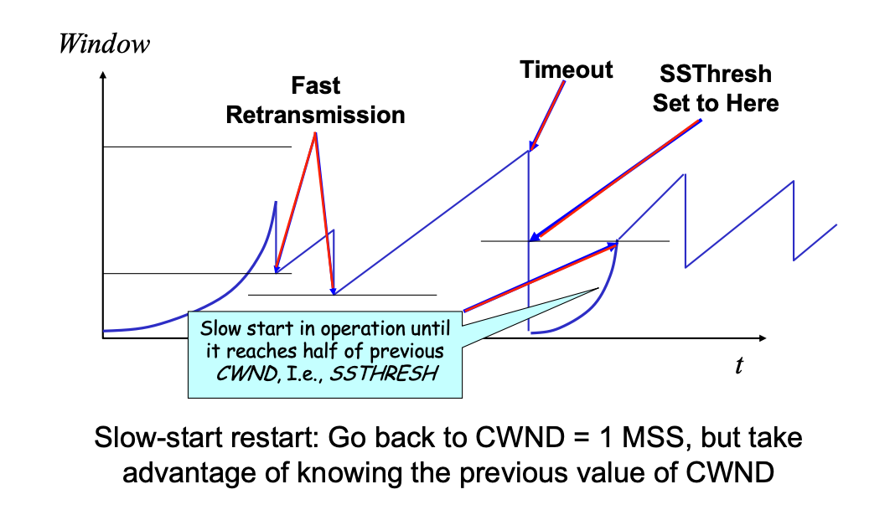

### ACK
```
If CWND < ssthresh
  CWND += 1 (Slow start phase)
Else
  CWND = CWND + 1/CWND (Congestion Avoidance phase)
```

### 3 dupACK
If dupACKcount = 3 (fast retransmit)
- ssthresh = CWND/2
- CWND = CWND/2

### Timeout
On Timeout
- ssthresh = CWND/2
- CWND = 1

## TCP Flavours
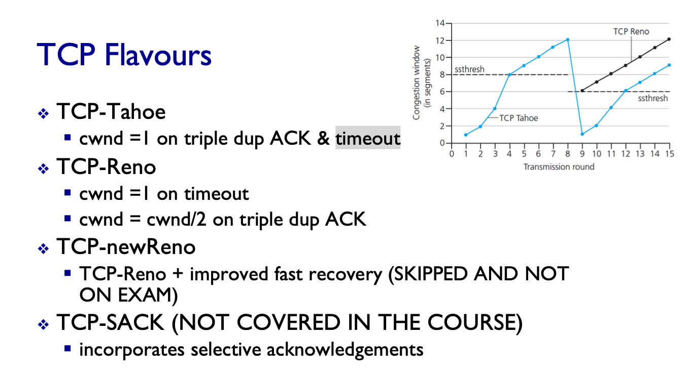

<br>

**TCP-Tahoe**  
Goes back to slow start on either triple dupACK and timeout.

**TCP-Reno**  
Goes back to slow start when either cwnd = 1 or timeout.

 